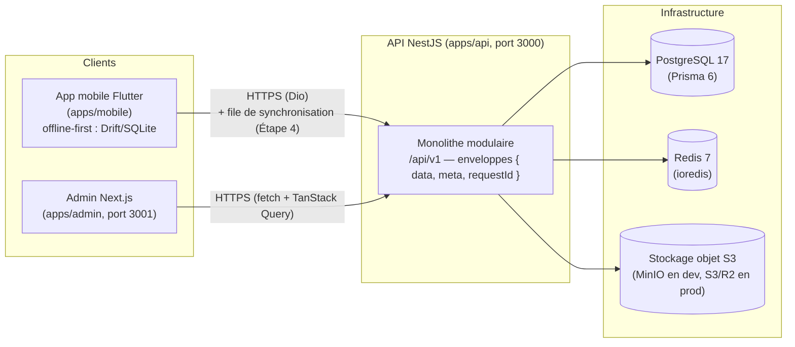

# Architecture — vue d'ensemble

Carlys est une plateforme fitness SaaS composée d'une application mobile
Flutter, d'une API NestJS et d'un tableau de bord d'administration Next.js,
organisées en monorepo pnpm. Ce document décrit l'architecture globale posée à
l'Étape 1 (fondation) et les principes qui guident les étapes suivantes.

## Schéma d'ensemble

En développement local, les briques d'infrastructure (PostgreSQL, Redis,
Mailpit pour les e-mails, MinIO pour le stockage S3) sont fournies par le
`docker-compose.yml` racine ; l'API et l'admin tournent en local (`pnpm dev`)
ou conteneurisées derrière le profil Compose `app`.

## Principes structurants

- **Monolithe modulaire, pas de microservices au départ.** Une seule API
  NestJS découpée en modules (`src/modules/*`) avec des frontières nettes.
  Les microservices n'apporteraient que de la complexité à ce stade ; le
  découpage modulaire préserve la possibilité d'extraire un service plus tard
  si un besoin réel apparaît.
- **Offline-first côté mobile.** L'application Flutter fonctionne sans réseau :
  base locale Drift/SQLite, puis file de synchronisation idempotente vers
  l'API (Étape 4). Le réseau est une optimisation, pas une condition.
- **Contrats d'API versionnés et normalisés.** Versioning URI (`/api/v1`),
  réponses systématiquement enveloppées — succès `{ data, meta, requestId }`,
  erreur `{ error: { code, message, details, requestId } }` — dont les schémas
  Zod vivent dans `packages/api-contracts` et sont consommés par l'admin (et à
  terme par tout client TypeScript). Les endpoints techniques (`/health`,
  `/health/live`, `/health/ready`, `/metrics`) sont volontairement hors
  préfixe `/api`.
- **Le serveur est la source d'autorité.** En particulier pour les
  entitlements d'abonnement (Étape 6) : le client affiche, le serveur décide.
  Aucune logique d'autorisation critique côté client.
- **Design tokens partagés.** `packages/design-tokens/src/tokens.json` est la
  source de vérité (primaire `#5B5BF6`, accent `#C6F432`, espacements,
  radius, typographie, ombres, motion, breakpoints). Le design system Flutter
  (`apps/mobile/lib/design_system`) et le thème Tailwind de l'admin reflètent
  ces valeurs.
- **Tranches verticales.** Chaque étape livre une fonctionnalité complète de
  bout en bout (schéma → API → clients → tests → docs) plutôt que des couches
  horizontales : Étape 1 fondation (faite), 2 authentification, 3 exercices,
  4 séances, 5 progression, 6 abonnements, 7 administration.

## Les briques

### API — `apps/api` (NestJS 11)

Cœur du système. TypeScript strict, Prisma 6 sur PostgreSQL 17 (schéma encore
vide : les modèles arrivent par tranches verticales), Redis via ioredis.
Garde-fous en place dès l'Étape 1 :

- configuration validée par Zod au démarrage (`src/config/env.schema.ts`) —
  le serveur **refuse de démarrer** si une variable essentielle manque ;
- logs structurés Pino (`nestjs-pino`) corrélés par `requestId`
  (en-tête `x-request-id`) ;
- Helmet, CORS restreint, rate limiting (`@nestjs/throttler`), corps JSON
  limité à 1 Mo ;
- validation stricte des entrées (`class-validator`, `whitelist` +
  `forbidNonWhitelisted`) ;
- Swagger sur `/api/docs` (désactivé en production) ;
- `/metrics` Prometheus, protégé par Bearer `METRICS_TOKEN` en production ;
- Dockerfile multi-stage (contexte de build : racine du monorepo) ;
- tests Jest unitaires + e2e (`/health/live` passe sans infrastructure).

Détails dans [backend.md](./backend.md).

### Admin — `apps/admin` (Next.js 16)

Tableau de bord d'administration : App Router, Tailwind CSS v4, TanStack
Query, React Hook Form + Zod, tests vitest + Testing Library, port 3001,
build `standalone` pour Docker. À l'Étape 1 : page d'accueil affichant le
statut de la plateforme (interrogation de `/health`) et `/login` comme
emplacement documenté — sans fausse authentification (l'auth admin arrive à
l'Étape 7). Détails dans [admin.md](./admin.md).

### Mobile — `apps/mobile` (Flutter)

Application utilisateur, volontairement **hors** du workspace pnpm (outillage
Dart/Flutter distinct). Architecture feature-first (`lib/app`, `lib/core`,
`lib/design_system`, `lib/features/<feature>/{data,domain,presentation}`,
`lib/shared`), Riverpod, GoRouter, Dio, Drift/SQLite, Freezed. Design system
initial complet (couleurs, typographie, espacements, thèmes clair/sombre/OLED,
composants de base) aligné sur les design tokens. Environnement injecté par
`--dart-define` (`CARLYS_FLAVOR`, `CARLYS_API_BASE_URL`) ; les dossiers de
plateformes se génèrent via `scripts/bootstrap_mobile.sh`. Détails dans
[mobile.md](./mobile.md).

## Packages partagés (`packages/`)

| Package | Rôle |
| --- | --- |
| `design-tokens` | `src/tokens.json`, source de vérité du design (couleurs, espacements 4→64, radius, typo, ombres, motion, breakpoints). |
| `api-contracts` | Schémas Zod des enveloppes de réponse et du rapport `/health` ; types partagés API ⇄ clients TypeScript. |
| `shared-config` | Constantes transverses : préfixe `api`, version `1`, en-tête `x-request-id`, pagination 20/100, rate limit 60 s / 100 req, corps 1 Mo. |
| `typescript-config` | Bases `tsconfig` (`base`/`library`/`nestjs`/`nextjs`), `strict` + `noUncheckedIndexedAccess`. |
| `eslint-config` | Flat config ESLint 9 + `typescript-eslint` strict, partagée. |

## Environnements et déploiement

Quatre environnements, distingués par `NODE_ENV`
(validé par `env.schema.ts` : `development | test | staging | production`) :

| Environnement | Rôle | Infrastructure |
| --- | --- | --- |
| development | poste développeur | Docker Compose local (PostgreSQL, Redis, Mailpit, MinIO) |
| test | CI GitHub Actions | services éphémères postgres + redis |
| staging | recette proche production | PostgreSQL/Redis managés, stockage S3/R2 |
| production | utilisateurs réels | PostgreSQL/Redis managés, stockage S3/R2 |

Flux de déploiement cible (cadre posé à l'Étape 1, mise en œuvre avec la
première release — voir `infrastructure/deployment/README.md`) :

1. CI verte sur la pull request (workflows `api-ci`, `admin-ci`, `mobile-ci`,
   `security-ci`) ;
2. construction des images Docker multi-stage, taguées par SHA ;
3. `prisma migrate deploy` exécuté comme étape distincte **avant** la bascule
   du trafic — jamais au démarrage du conteneur ;
4. bascule pilotée par les health checks (`/health/ready`) ;
5. staging automatique depuis `main`, production **manuelle** après
   validation humaine.

## Documents liés

- [backend.md](./backend.md) — architecture de l'API NestJS ;
- [admin.md](./admin.md) — architecture du tableau de bord Next.js ;
- [mobile.md](./mobile.md) — architecture de l'application Flutter ;
- [`docs/api/`](../api/) — conventions et contrats de l'API ;
- [`docs/database/`](../database/) — base de données et migrations ;
- [`docs/synchronization/`](../synchronization/) — synchronisation offline-first ;
- [`docs/security/`](../security/) — sécurité ;
- [`docs/decisions/`](../decisions/) — décisions d'architecture (ADR).
