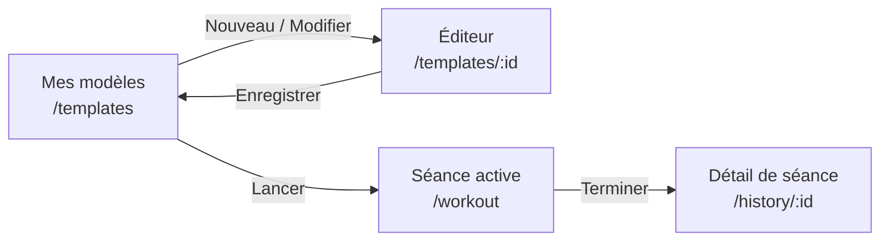

# Modèles de séance — contrat de développement

> **Statut : spécification.** Aucun code de cette fonctionnalité n'existe
> encore. Ce document est le **contrat** : il fixe le modèle de données, les
> endpoints, les entités mobiles, la file de synchronisation et le parcours
> utilisateur avec assez de précision pour que l'équipe API et l'équipe mobile
> avancent **en parallèle sans se coordonner**. Tout écart au contrat se
> discute ici avant d'être codé.

## 1. Le besoin, en une phrase

L'utilisateur **compose et enregistre un modèle de séance** (un nom, une liste
d'exercices, et pour chaque exercice des séries prévues avec répétitions,
charge et repos), puis **le lance** : une séance réelle démarre, pré-remplie
par le programme ; pendant la séance il voit ce qu'il doit faire (« série 2 sur
4, 8 reps à 60 kg »), il valide chaque série — **en saisissant ce qu'il a
réellement fait**, qui peut différer du prévu — et il suit son avancement. À la
fin, la séance rejoint l'historique existant.

### Ce qui existe déjà et qu'on ne remplace pas

| Existant                                                          | Rôle                                                       |
| ----------------------------------------------------------------- | ---------------------------------------------------------- |
| `WorkoutSession` / `WorkoutSet` (Prisma, migration `20260807010000_workout_sessions`) | Les séances **réalisées**, ids générés sur l'appareil, écritures rejouables |
| Module API `workout_sessions`                                     | `POST /workout-sessions`, `…/sets`, `…/complete`, `…/abandon` |
| `apps/mobile/lib/features/workout_session/`                       | Séance offline-first : Drift → file de sync → API           |
| `apps/mobile/lib/core/synchronization/`                           | Moteur FIFO, backoff, idempotence par id d'entité            |
| `ActiveWorkoutBody`, `SetEntryCard`, `WorkoutProgressSegments`     | Écran de séance active : pas-à-pas charge/répétitions, validation de série |
| `packages/api-contracts/src/workouts.ts`                          | `WorkoutSet`, `WorkoutSessionSummary`, `WorkoutSessionDetail`, `WORKOUT_LIMITS` |

Le modèle de séance **se branche** sur cet ensemble : il ajoute une source de
prescription en amont, il ne change ni la nature ni le cycle de vie des séances
réalisées.

### Vocabulaire

Il est **imposé** : ces mots-là, partout, dans le code comme dans l'interface.

| Terme français         | Terme technique              | Définition                                                        |
| ---------------------- | ---------------------------- | ----------------------------------------------------------------- |
| **Modèle de séance**   | `WorkoutTemplate`            | Document **prescriptif** réutilisable : ce qui est prévu           |
| **Ligne d'exercice**   | `WorkoutTemplateExercise`    | Un exercice du modèle, à une position donnée                       |
| **Série prévue**       | `WorkoutTemplateSet`         | Une série prescrite d'une ligne d'exercice (cibles reps / charge)  |
| **Séance**             | `WorkoutSession`             | Réalisation **factuelle** — existe déjà                            |
| **Série**              | `WorkoutSet`                 | Fait historique : ce qui a réellement été fait — existe déjà       |
| **Plan de séance**     | `LocalSessionPlanItem`       | Copie locale du modèle, matérialisée au lancement d'une séance     |
| **Lancer un modèle**   | —                            | Créer une séance à partir d'un modèle                              |
| **Déviation**          | —                            | Écart entre le prévu et le réalisé — **normal, jamais une erreur** |

Le mot « programme » reste réservé aux structures **multi-semaines**
(`TrainingProgram`, `ProgramWeek`, `ProgramDay` de
[`docs/database/schema.md`](../database/schema.md)) — hors périmètre ici, voir
[§8, D9](#d9--programmes-multi-semaines--hors-périmètre).

---

## 2. Modèle de données (PostgreSQL / Prisma)

Trois nouveaux modèles, deux modèles existants enrichis. Une seule migration :
`apps/api/prisma/migrations/<timestamp>_workout_templates/`.

### 2.1 Conventions respectées

Reprises telles quelles de l'existant (`apps/api/prisma/schema.prisma`) :

- **Identifiants** : `String @id @db.Uuid` **sans** `@default(uuid())` sur les
  trois nouveaux modèles — l'UUID vient de l'appareil (offline-first).
- **Dates** : UTC, `createdAt @default(now())` + `updatedAt @updatedAt`.
- **Suppression logique** : `deletedAt DateTime?` sur `WorkoutTemplate`
  uniquement (voir [D3](#d3--suppression-dun-modèle)).
- **Pas de `@@map`** : le schéma actuel n'en utilise pas, on ne commence pas
  ici.
- **Énumérations réutilisées** : `WorkoutSetKind` (`WARMUP | NORMAL | DROP`)
  sert aussi aux séries prévues. **Aucun nouvel enum.**
- **Nom d'exercice dénormalisé** : `exerciseName` obligatoire à côté d'un
  `exerciseId` nullable, exactement comme `WorkoutSet` — un modèle survit à la
  dépublication d'un exercice du catalogue.

### 2.2 `WorkoutTemplate`

```prisma
/// Modèle de séance : ce que l'utilisateur a PRÉVU de faire, réutilisable.
/// L'id est un UUID généré SUR L'APPAREIL — l'écriture est rejouable.
model WorkoutTemplate {
  id                       String    @id @db.Uuid
  userId                   String    @db.Uuid
  name                     String
  notes                    String?
  /// Saisie facultative de l'utilisateur — JAMAIS calculée par le serveur.
  estimatedDurationMinutes Int?
  /// Dernier lancement : posé à la création d'une séance qui référence ce modèle.
  lastUsedAt               DateTime?
  createdAt                DateTime  @default(now())
  updatedAt                DateTime  @updatedAt
  deletedAt                DateTime?

  user      User                      @relation(fields: [userId], references: [id], onDelete: Cascade)
  exercises WorkoutTemplateExercise[]
  sessions  WorkoutSession[]

  @@index([userId, updatedAt(sort: Desc)])
}
```

| Champ                      | Type       | Contraintes                                        |
| -------------------------- | ---------- | -------------------------------------------------- |
| `id`                       | `uuid`     | PK, **fourni par le client**                       |
| `userId`                   | `uuid`     | FK `User`, `onDelete: Cascade`                     |
| `name`                     | `text`     | 1 à `WORKOUT_LIMITS.nameMax` (120), trimé          |
| `notes`                    | `text?`    | ≤ `WORKOUT_LIMITS.notesMax` (2 000)                |
| `estimatedDurationMinutes` | `int?`     | 1 à 1 440                                          |
| `lastUsedAt`               | `timestamptz?` | Écrit par le serveur, jamais par le client     |
| `deletedAt`                | `timestamptz?` | Toutes les lectures filtrent `deletedAt: null` |

**Pas d'unicité sur `name`** — voir [D6](#d6--pas-dunicité-de-nom).

### 2.3 `WorkoutTemplateExercise`

```prisma
/// Ligne d'exercice prescrite dans un modèle, ordonnée.
/// exerciseName est dénormalisé : le modèle survit au catalogue.
model WorkoutTemplateExercise {
  id           String  @id @db.Uuid
  templateId   String  @db.Uuid
  exerciseId   String? @db.Uuid
  exerciseName String
  position     Int
  notes        String?

  template WorkoutTemplate       @relation(fields: [templateId], references: [id], onDelete: Cascade)
  exercise Exercise?             @relation(fields: [exerciseId], references: [id], onDelete: SetNull)
  sets     WorkoutTemplateSet[]

  @@unique([templateId, position])
  @@index([exerciseId])
}
```

- `position` : entier **contigu à partir de 0**, attribué par le serveur depuis
  l'ordre du tableau reçu (voir [D4](#d4--put-de-remplacement-complet)).
  L'unicité `(templateId, position)` tient parce que le contenu est **toujours
  réécrit intégralement dans une transaction** (suppression physique puis
  recréation) — jamais de renumérotation partielle.
- `exerciseId` nullable : exercice hors catalogue (« exercice libre »), déjà
  possible dans la séance active.
- `notes` : ≤ `WORKOUT_LIMITS.notesMax`.

### 2.4 `WorkoutTemplateSet`

```prisma
/// Série prévue d'une ligne d'exercice. Cibles, pas mesures :
/// ce qui sera réellement fait vit dans WorkoutSet.
model WorkoutTemplateSet {
  id                 String         @id @db.Uuid
  templateExerciseId String         @db.Uuid
  position           Int
  kind               WorkoutSetKind @default(NORMAL)
  targetReps         Int?
  targetWeightKg     Decimal?       @db.Decimal(6, 2)
  restSeconds        Int?

  templateExercise WorkoutTemplateExercise @relation(fields: [templateExerciseId], references: [id], onDelete: Cascade)

  @@unique([templateExerciseId, position])
}
```

| Champ            | Bornes (partagées client/serveur)     |
| ---------------- | ------------------------------------- |
| `targetReps`     | 0 à `WORKOUT_LIMITS.repsMax` (1 000)  |
| `targetWeightKg` | 0 à `WORKOUT_LIMITS.weightKgMax` (1 000), 2 décimales |
| `restSeconds`    | 0 à `WORKOUT_LIMITS.restSecondsMax` (3 600) |

Les trois cibles sont **facultatives** : un modèle « 4 × 8 » sans charge
prévue est légitime (poids du corps, charge décidée le jour même).
`durationSeconds` / `distanceMeters` ne sont **pas** prévus dans un modèle au
MVP — voir [D8](#d8--une-seule-mesure-prévue--reps--charge).

### 2.5 Modifications des modèles existants

#### `WorkoutSession` — provenance de la séance

```prisma
model WorkoutSession {
  // … champs existants inchangés …
  /// Modèle lancé, s'il y en a un. SetNull : une purge physique du modèle
  /// n'efface jamais la séance.
  templateId   String? @db.Uuid
  /// Nom du modèle AU MOMENT DU LANCEMENT — dénormalisé, immuable :
  /// l'historique reste lisible même modèle supprimé ou renommé.
  templateName String?

  template WorkoutTemplate? @relation(fields: [templateId], references: [id], onDelete: SetNull)

  @@index([templateId])
}
```

`name` (existant) reste le **titre modifiable de cette séance** ; `templateName`
est la **provenance immuable**. Les deux coexistent : renommer la séance ne
falsifie pas son origine.

#### `WorkoutSet` — la cible affichée au moment de la validation

```prisma
model WorkoutSet {
  // … champs existants inchangés …
  /// Cible AFFICHÉE quand l'utilisateur a validé cette série (null hors modèle).
  /// Fait historique : jamais modifiable après coup.
  plannedReps     Int?
  plannedWeightKg Decimal? @db.Decimal(6, 2)
}
```

C'est ce qui permet à l'historique de dire « prévu 8 × 60 kg, fait 7 × 60 kg »
des mois plus tard, sans dépendre d'un modèle qui aura peut-être changé.

#### `User` et `Exercise`

```prisma
model User {
  // …
  workoutTemplates WorkoutTemplate[]
}

model Exercise {
  // …
  templateExercises WorkoutTemplateExercise[]
}
```

### 2.6 Migration

Un seul dossier `apps/api/prisma/migrations/<timestamp>_workout_templates/` :

1. `CREATE TABLE "WorkoutTemplate"`, `"WorkoutTemplateExercise"`,
   `"WorkoutTemplateSet"` + index et clés étrangères ;
2. `ALTER TABLE "WorkoutSession" ADD COLUMN "templateId" uuid NULL`,
   `ADD COLUMN "templateName" text NULL` + FK `ON DELETE SET NULL` + index ;
3. `ALTER TABLE "WorkoutSet" ADD COLUMN "plannedReps" integer NULL`,
   `ADD COLUMN "plannedWeightKg" numeric(6,2) NULL`.

Toutes les colonnes ajoutées sont **nullables sans valeur par défaut** : la
migration est non bloquante et ne réécrit aucune ligne existante. Aucun seed :
un modèle de séance appartient à un utilisateur, il n'y a rien à pré-remplir.

---

## 3. Contrats partagés — `packages/api-contracts`

Nouveau fichier `packages/api-contracts/src/workout-templates.ts`, exporté
depuis `index.ts`. Les schémas Zod sont la **source de vérité** des deux côtés
du réseau.

```ts
export const workoutTemplateSetSchema = z.object({
  id: z.string(),
  position: z.number(),
  kind: workoutSetKindSchema, // réutilisé depuis ./workouts
  targetReps: z.number().nullable(),
  targetWeightKg: z.number().nullable(),
  restSeconds: z.number().nullable(),
});

export const workoutTemplateExerciseSchema = z.object({
  id: z.string(),
  exerciseId: z.string().nullable(),
  /** Dénormalisé : le modèle survit aux évolutions du catalogue. */
  exerciseName: z.string(),
  position: z.number(),
  notes: z.string().nullable(),
  sets: z.array(workoutTemplateSetSchema),
});

export const workoutTemplateSummarySchema = z.object({
  id: z.string(),
  name: z.string(),
  exercisesCount: z.number(),
  plannedSetsCount: z.number(),
  estimatedDurationMinutes: z.number().nullable(),
  /** Trois premiers exercices, dans l'ordre — sous-titre de la carte. */
  previewExerciseNames: z.array(z.string()),
  lastUsedAt: z.string().nullable(),
  updatedAt: z.string(),
});

export const workoutTemplateDetailSchema = workoutTemplateSummarySchema.extend({
  notes: z.string().nullable(),
  createdAt: z.string(),
  exercises: z.array(workoutTemplateExerciseSchema),
});

/** Bornes propres aux modèles ; le reste vient de WORKOUT_LIMITS. */
export const WORKOUT_TEMPLATE_LIMITS = {
  exercisesMax: 30,
  setsPerExerciseMax: 20,
  estimatedDurationMinutesMax: 1_440,
} as const;
```

### Ajouts aux contrats existants (`src/workouts.ts`)

Additifs, donc **non cassants** pour `/api/v1` :

```ts
// workoutSetSchema
plannedReps: z.number().nullable(),
plannedWeightKg: z.number().nullable(),

// workoutSessionSummarySchema
templateId: z.string().nullable(),
templateName: z.string().nullable(),
```

---

## 4. API REST

Nouveau module `apps/api/src/modules/workout_templates/`, même découpage que
`workout_sessions` : contrôleur mince → service → repository Prisma. Toutes les
routes sont sous `/api/v1`, authentifiées (guard global), enveloppées
(`{ data, meta, requestId }` / `{ error: { code, message, details, requestId } }`),
documentées dans Swagger (`@ApiTags('workout-templates')`).

### 4.1 Tableau des routes

| Méthode  | Chemin                             | Statuts             | Idempotence                               |
| -------- | ---------------------------------- | ------------------- | ----------------------------------------- |
| `GET`    | `/api/v1/workout-templates`        | 200, 401            | Lecture                                   |
| `GET`    | `/api/v1/workout-templates/:id`    | 200, 401, 404       | Lecture                                   |
| `PUT`    | `/api/v1/workout-templates/:id`    | 200, 201, 400, 401, 404, 409 | **Naturelle** : le corps décrit l'état final |
| `DELETE` | `/api/v1/workout-templates/:id`    | 204, 401, 404       | Rejouable : supprimer deux fois → 204     |

### 4.2 `GET /api/v1/workout-templates`

Liste des modèles de l'utilisateur, **pagination par curseur** (convention
maison, jamais d'offset).

| Paramètre | Valeur                                                  |
| --------- | ------------------------------------------------------- |
| `limit`   | défaut `DEFAULT_PAGE_SIZE` (20), max `MAX_PAGE_SIZE` (100) |
| `cursor`  | UUID du dernier modèle servi (opaque pour le client)    |

Tri : `updatedAt DESC, id DESC` (le modèle qu'on vient de retoucher remonte).
Filtre : `userId` + `deletedAt: null`.

```json
{
  "data": [
    {
      "id": "3f1c…",
      "name": "Push — Force",
      "exercisesCount": 4,
      "plannedSetsCount": 14,
      "estimatedDurationMinutes": 55,
      "previewExerciseNames": ["Développé couché", "Développé militaire", "Dips"],
      "lastUsedAt": "2026-08-05T17:32:00.000Z",
      "updatedAt": "2026-08-06T09:10:00.000Z"
    }
  ],
  "meta": { "nextCursor": "3f1c…", "hasMore": false },
  "requestId": "6f1cbb3e-…"
}
```

### 4.3 `GET /api/v1/workout-templates/:id`

`WorkoutTemplateDetail` complet (exercices ordonnés, séries ordonnées). Modèle
inexistant, supprimé, ou appartenant à quelqu'un d'autre → **404 `NOT_FOUND`
dans les trois cas** : on ne révèle jamais l'existence des données d'autrui
(règle déjà appliquée par `WorkoutsService.ownedSession`).

### 4.4 `PUT /api/v1/workout-templates/:id` — créer ou remplacer

**L'unique écriture.** Le corps décrit l'**état complet** du modèle ; le
serveur fait converger la base vers cet état, en une transaction.

Requête :

```json
{
  "name": "Push — Force",
  "notes": "Focus haut du pectoral",
  "estimatedDurationMinutes": 55,
  "exercises": [
    {
      "id": "a1b2…",
      "exerciseId": "e9f0…",
      "exerciseName": "Développé couché",
      "notes": null,
      "sets": [
        { "id": "c3d4…", "kind": "WARMUP", "targetReps": 12, "targetWeightKg": 40, "restSeconds": 60 },
        { "id": "c3d5…", "kind": "NORMAL", "targetReps": 8, "targetWeightKg": 70, "restSeconds": 120 },
        { "id": "c3d6…", "kind": "NORMAL", "targetReps": 8, "targetWeightKg": 70, "restSeconds": 120 }
      ]
    }
  ]
}
```

Règles :

- `:id` et **tous** les `id` imbriqués sont des **UUID générés sur
  l'appareil**. Ils sont conservés tels quels : c'est ce qui rend le rejeu
  identique.
- **Les positions ne sont pas transmises** : l'ordre du tableau JSON fait foi,
  le serveur écrit `position = index`. Un client ne peut donc pas produire de
  trou ni de doublon de position.
- `exerciseName` est résolu comme pour les séries : si `exerciseId` désigne un
  exercice **publié**, son nom du catalogue gagne ; sinon on retient
  `exerciseName` trimé ; si les deux manquent → `400 VALIDATION_ERROR`.
  Réutiliser `WorkoutsRepository.exercisePublishedName` par une méthode
  équivalente du repository des modèles.
- Écriture en **une transaction Prisma** :
  `upsert` du `WorkoutTemplate` → `deleteMany` des `WorkoutTemplateExercise` du
  modèle (cascade sur les séries) → `createMany` des lignes et des séries
  reçues. Suppression **physique** du contenu : le contenu d'un modèle n'est
  pas de l'historique ([D3](#d3--suppression-dun-modèle)).
- **201** si le modèle n'existait pas, **200** s'il a été remplacé. Un rejeu à
  l'identique renvoie 200 et le même corps.
- Réponse : `WorkoutTemplateDetail` (l'état après écriture, positions
  comprises) — le client peut réconcilier sans second appel.

Erreurs :

| Code                | Statut | Cas                                                                    |
| ------------------- | ------ | ---------------------------------------------------------------------- |
| `VALIDATION_ERROR`  | 400    | DTO invalide : bornes, `exercises` vide, > `exercisesMax`, > `setsPerExerciseMax`, `exerciseId` inconnu **et** `exerciseName` absent, ids dupliqués dans le corps |
| `UNAUTHORIZED`      | 401    | Pas de jeton valide                                                    |
| `NOT_FOUND`         | 404    | `:id` existe mais est supprimé logiquement (on ne ressuscite pas un modèle par un PUT) |
| `CONFLICT`          | 409    | `:id` appartient à un autre utilisateur                                |

`class-validator` en `whitelist` + `forbidNonWhitelisted`, avec
`@ValidateNested({ each: true })` + `@Type(...)` sur les tableaux imbriqués.

### 4.5 `DELETE /api/v1/workout-templates/:id`

Suppression **logique** (`deletedAt = now()`), **204 No Content**. Rejouable,
avec la même sémantique que `WorkoutsService.deleteSet` :

- modèle inconnu → **204** (le rejeu d'une suppression déjà propagée doit
  aboutir) ;
- modèle d'un autre utilisateur → **404** ;
- modèle déjà supprimé → **204**.

Les séances passées ne sont **pas** touchées ([D3](#d3--suppression-dun-modèle)).

### 4.6 Modifications des endpoints de séance existants

#### `POST /api/v1/workout-sessions` — deux champs facultatifs

```jsonc
{
  "id": "…uuid appareil…",
  "name": "Push — Force",
  "startedAt": "2026-08-08T17:02:00.000Z",
  "templateId": "3f1c…", //  facultatif
  "templateName": "Push — Force" //  facultatif, secours client
}
```

Résolution côté service, **qui n'échoue jamais à cause du modèle** (même esprit
que `resolveExerciseName`) :

1. `templateId` désigne un modèle **de cet utilisateur, non supprimé** →
   on enregistre `templateId` + `templateName = template.name` (nom serveur),
   et on pose `template.lastUsedAt = session.startedAt` **dans la même
   transaction** ;
2. sinon → `templateId = null`, `templateName = templateName` du corps (trimé)
   ou `null`.

Ce point est structurant : si l'opération `template.save` a été refusée
définitivement par le serveur, la séance arrive quand même, avec le nom du
programme conservé. **Aucune séance n'est jamais perdue à cause d'un modèle.**

#### `POST /api/v1/workout-sessions/:id/sets` — la cible du moment

Deux champs facultatifs supplémentaires, mêmes bornes que `reps` / `weightKg` :

```jsonc
{
  "id": "…",
  "exerciseId": "…",
  "position": 4,
  "reps": 7, //  ce qui a été FAIT
  "weightKg": 60,
  "plannedReps": 8, //  ce qui était PRÉVU / affiché
  "plannedWeightKg": 60,
  "restSeconds": 120,
  "completedAt": "2026-08-08T17:19:30.000Z"
}
```

`PATCH /api/v1/workout-sets/:id` **ne les accepte pas** : corriger une série,
c'est corriger le fait réalisé ; la cible affichée à l'instant de la validation
n'est pas réécrivable.

### 4.7 Journalisation et audit

Logs Pino corrélés au `requestId` (en-tête `x-request-id`), comme partout :
un log `info` par écriture (`workout_template.saved`,
`workout_template.deleted`) avec `templateId`, `exercisesCount`,
`plannedSetsCount` — **jamais** le contenu textuel des notes. Pas d'entrée
`AuditLog` : ce journal est réservé aux événements de sécurité et aux actions
d'administration.

---

## 5. Contrat côté mobile (Flutter)

Nouvelle fonctionnalité `apps/mobile/lib/features/workout_template/`, structure
feature-first `{data,domain,presentation}`. Elle **dépend** de
`workout_session` (pour lancer une séance) ; l'inverse est interdit — la séance
active reçoit son plan par un provider, elle n'importe pas la fonctionnalité
modèle.

### 5.1 Entités du domaine (`domain/entities/workout_template.dart`)

Immuables, écrites à la main (convention du dépôt, cf.
`workout_session/domain/entities/workout.dart`), français, `const` partout.

```dart
class PlannedSet {
  final String id;
  final int position;
  final SetKind kind;          // réutilisé depuis workout_session
  final int? targetReps;
  final double? targetWeightKg;
  final int? restSeconds;
}

class TemplateExerciseEntry {
  final String id;
  final String? exerciseId;
  final String exerciseName;
  final int position;
  final String? notes;
  final List<PlannedSet> sets;
}

class WorkoutTemplateInfo {         // carte de la liste
  final String id;
  final String name;
  final int exercisesCount;
  final int plannedSetsCount;
  final int? estimatedDurationMinutes;
  final List<String> previewExerciseNames;
  final DateTime? lastUsedAt;       // UTC
  final DateTime updatedAt;         // UTC
  final LocalSyncState syncState;   // réutilisé depuis workout_session
}

class WorkoutTemplateDetail {
  final WorkoutTemplateInfo info;
  final String? notes;
  final List<TemplateExerciseEntry> exercises;
}
```

Entrées d'écriture (`SaveTemplateInput`, `TemplateExerciseInput`,
`PlannedSetInput`) : mêmes champs, `id` **facultatif** — le repository génère un
UUID v4 quand il est absent, jamais l'interface.

### 5.2 Élément de plan (`domain/entities/session_plan.dart`)

Le plan matérialisé pour la séance en cours. **Aplati : une entrée par série
prévue** — c'est la forme dont l'écran a besoin (« série 2 sur 4 »).

```dart
class SessionPlanItem {
  final String id;
  final String sessionId;
  final int exercisePosition;
  final String? exerciseId;
  final String exerciseName;
  final int setPosition;        // rang de la série DANS l'exercice, à partir de 0
  final SetKind kind;
  final int? targetReps;
  final double? targetWeightKg;
  final int? restSeconds;
  final String? doneSetId;      // WorkoutSet qui l'a honorée, sinon null
  final bool skipped;
}

class SessionPlan {
  final String sessionId;
  final String templateName;
  final List<SessionPlanItem> items;

  int get doneCount;            // items avec doneSetId != null
  int get totalCount;           // items.length
  SessionPlanItem? get current; // premier item ni fait ni sauté
}
```

### 5.3 Tables Drift (`core/database/app_database.dart`)

Quatre tables ajoutées, deux tables existantes enrichies.
**`schemaVersion` passe de 1 à 2** et l'`AppDatabase` doit désormais déclarer
une `MigrationStrategy` (`onUpgrade` : `createTable` × 4 + `addColumn` × 4).
C'est aujourd'hui absent — c'est la première migration locale du projet, elle
doit être testée (`test/core/app_database_migration_test.dart`).

```dart
class LocalWorkoutTemplates extends Table {
  TextColumn    get id => text()();                       // UUID appareil
  TextColumn    get name => text()();
  TextColumn    get notes => text().nullable()();
  IntColumn     get estimatedDurationMinutes => integer().nullable()();
  DateTimeColumn get lastUsedAt => dateTime().nullable()();
  DateTimeColumn get updatedAt => dateTime()();
  BoolColumn    get deleted => boolean().withDefault(const Constant(false))();
  TextColumn    get syncStatus => text().withDefault(const Constant('pending'))();
  @override Set<Column<Object>> get primaryKey => {id};
}

class LocalTemplateExercises extends Table {
  TextColumn get id => text()();
  TextColumn get templateId => text()();
  TextColumn get exerciseId => text().nullable()();
  TextColumn get exerciseName => text()();
  IntColumn  get position => integer()();
  TextColumn get notes => text().nullable()();
  @override Set<Column<Object>> get primaryKey => {id};
}

class LocalTemplateSets extends Table {
  TextColumn get id => text()();
  TextColumn get templateExerciseId => text()();
  IntColumn  get position => integer()();
  TextColumn get kind => text().withDefault(const Constant('NORMAL'))();
  IntColumn  get targetReps => integer().nullable()();
  RealColumn get targetWeightKg => real().nullable()();
  IntColumn  get restSeconds => integer().nullable()();
  @override Set<Column<Object>> get primaryKey => {id};
}

/// Plan de la séance en cours — synchronisé sans opération dédiée (D5).
class LocalSessionPlanItems extends Table {
  TextColumn get id => text()();
  TextColumn get sessionId => text()();
  IntColumn  get exercisePosition => integer()();
  TextColumn get exerciseId => text().nullable()();
  TextColumn get exerciseName => text()();
  IntColumn  get setPosition => integer()();
  TextColumn get kind => text().withDefault(const Constant('NORMAL'))();
  IntColumn  get targetReps => integer().nullable()();
  RealColumn get targetWeightKg => real().nullable()();
  IntColumn  get restSeconds => integer().nullable()();
  TextColumn get doneSetId => text().nullable()();
  BoolColumn get skipped => boolean().withDefault(const Constant(false))();
  TextColumn get syncStatus => text().withDefault(const Constant('pending'))();
  @override Set<Column<Object>> get primaryKey => {id};
}
```

Enrichissements :

| Table                  | Colonnes ajoutées                                      |
| ---------------------- | ------------------------------------------------------ |
| `LocalWorkoutSessions` | `templateId TEXT?`, `templateName TEXT?`               |
| `LocalWorkoutSets`     | `plannedReps INT?`, `plannedWeightKg REAL?`            |

Suppression du contenu local d'un modèle : les lignes `LocalTemplateExercises`
et `LocalTemplateSets` sont **physiquement remplacées** à chaque enregistrement
(même transaction), en miroir exact du serveur. Le modèle lui-même porte un
`deleted` (tombstone) jusqu'à l'acquittement.

### 5.4 File de synchronisation

Deux nouveaux `operationType`, à ajouter à `SyncEngine._send` et à `SyncApi` :

| `operationType`   | `entityType` | Appel HTTP                          | `payload`                                  |
| ----------------- | ------------ | ----------------------------------- | ------------------------------------------ |
| `template.save`   | `template`   | `PUT /workout-templates/{entityId}` | `{ "body": { … corps complet §4.4 … } }`   |
| `template.delete` | `template`   | `DELETE /workout-templates/{entityId}` | `{ "id": "…" }`                         |

Rien d'autre ne change dans le moteur : `idempotencyKey = entityId`, FIFO
strict, backoff 5 s → 5 min, 4xx (hors 401) → `failed` sans bloquer la file,
opération réussie supprimée. `SyncEngine._markEntity` doit apprendre
`entityType == 'template'` pour écrire `syncStatus` sur
`LocalWorkoutTemplates`.

**Ordre garanti par le FIFO global** : `template.save` est enfilée à
l'enregistrement, `session.create` au lancement — donc toujours après. Et même
si `template.save` échoue définitivement, la séance passe quand même
([§4.6](#46-modifications-des-endpoints-de-séance-existants)).

Les opérations `session.create` et `set.upsert` existantes voient simplement
leur `payload` s'enrichir des champs facultatifs — **aucun changement de
format**, les opérations déjà en file dans une installation existante restent
rejouables.

### 5.5 Repositories et contrôleurs

```dart
abstract interface class WorkoutTemplateRepository {
  Stream<List<WorkoutTemplateInfo>> watchTemplates();     // local, temps réel
  Future<WorkoutTemplateDetail?> templateDetail(String templateId);
  Future<String> saveTemplate(SaveTemplateInput input);   // crée ou remplace
  Future<void> deleteTemplate(String templateId);

  /// Lance le modèle : crée la séance (UUID client) ET matérialise le plan,
  /// dans UNE SEULE transaction locale. Renvoie l'id de séance.
  Future<String> startFromTemplate(String templateId);

  /// Plan de la séance en cours, en temps réel.
  Stream<SessionPlan?> watchSessionPlan(String sessionId);

  /// Marque l'item de plan honoré par une série validée.
  Future<void> fulfillPlanItem({required String planItemId, required String setId});

  Future<void> skipPlanItem(String planItemId);
  Future<void> skipPlanExercise(String sessionId, int exercisePosition);
}
```

`startFromTemplate` **n'appelle jamais l'API** : il lit le modèle local, écrit
la séance dans `LocalWorkoutSessions` (avec `templateId` / `templateName`),
insère les `LocalSessionPlanItems`, enfile `session.create` — le tout dans une
transaction SQLite, puis notifie le moteur. Lancer un modèle **fonctionne
intégralement hors ligne**, y compris au premier lancement.

Providers (`presentation/controllers/workout_template_controllers.dart`) :
`workoutTemplateRepositoryProvider`, `workoutTemplatesProvider`
(`StreamProvider`), `workoutTemplateDetailProvider` (`FutureProvider.family`),
`sessionPlanProvider` (`StreamProvider.family<SessionPlan?, String>`),
`workoutTemplateActionsProvider`. **Aucun widget n'appelle l'API** : écran →
contrôleur → repository, comme partout.

### 5.6 Règle d'appariement plan ↔ série réalisée

Déterministe, sans heuristique, et énoncée une fois pour toutes :

> À la validation d'une série, l'application honore le **premier item de plan
> de l'exercice courant qui n'est ni fait ni sauté**. S'il n'y en a aucun (série
> supplémentaire, ou exercice hors programme), **aucun item n'est honoré** : la
> série est enregistrée normalement, sans `plannedReps` / `plannedWeightKg`.

Conséquences directes, toutes voulues :

- l'avancement affiché ne dépasse jamais 100 % ;
- une série en trop ne « consomme » pas une série prévue plus loin ;
- l'appariement n'est jamais recalculé après coup — une correction de série via
  `PATCH` ne le remet pas en cause.

### 5.7 Mode démo

Le flavor `demo` doit rester complet : `lib/demo/demo_templates.dart` fournit
un `DemoWorkoutTemplateRepository` en mémoire (2 modèles, cohérents avec les
exercices de `demo_workouts.dart`), branché dans `demoOverrides()`. Exception
documentée à « pas de données codées en dur », déjà en vigueur pour ce dossier.

---

## 6. Parcours utilisateur, écran par écran



Routes ajoutées à `lib/app/router/app_routes.dart` (plein écran, hors coquille
à onglets, comme `/workout` et `/history`) :

```dart
static const String templates = '/templates';
static String templateEditor(String templateId) => '/templates/$templateId';
```

Il n'y a **pas** de route `/templates/new` : créer un modèle, c'est générer un
UUID côté client puis ouvrir `/templates/<uuid>`. C'est la traduction directe du
principe « identifiants générés hors ligne », et ça évite la collision de
chemins `new` / `:templateId`.

### 6.1 Écran « Mes modèles » — `/templates`

**Contenu.** En-tête `AppSectionHeader` « Mes modèles » + action « Nouveau ».
Une `AppCard` par modèle : nom, `previewExerciseNames` joints par « · »,
`plannedSetsCount` séries et `exercisesCount` exercices (formatés via
`formatThousands`), `lastUsedAt` en `formatRelativeDayMono`, et un
`AppButton` accent « Lancer ». Appui long / menu : Modifier, Dupliquer
(hors périmètre MVP), Supprimer.

**Accès.** Depuis l'accueil (`TodayWorkoutCard` : « Lancer un modèle » quand
aucune séance n'est en cours) et depuis le profil.

**États.**

| État        | Rendu                                                                    |
| ----------- | ------------------------------------------------------------------------ |
| Chargement  | `AppLoadingIndicator`                                                     |
| Vide        | `AppEmptyState` — « Aucun modèle », « Composez votre séance type une fois, relancez-la en un geste », action « Créer un modèle », icône `AppIcons.workout` |
| Erreur      | `AppErrorState` avec `onRetry` (invalide le provider)                     |
| Hors ligne  | **La liste s'affiche normalement** (elle vient de Drift). Les modèles non acquittés portent un `AppPill` discret « En attente » (`syncState`) ; un `failed` affiche « Non synchronisé » + réessai |

**Accessibilité.** Chaque carte est un `Semantics` unique annonçant
« Modèle Push — Force, 4 exercices, 14 séries prévues » ; le bouton « Lancer »
a son propre label.

### 6.2 Écran « Éditeur de modèle » — `/templates/:templateId`

Sert la création et la modification : la seule différence est que la création
part d'un brouillon vide.

**Contenu.**

1. `AppTextField` « Nom de la séance » (obligatoire, ≤ 120) ;
2. `AppTextField` multiligne « Notes » (facultatif) et « Durée estimée »
   (facultatif, en minutes) ;
3. liste réordonnable des lignes d'exercice (`ReorderableListView`) — chaque
   ligne : nom de l'exercice, nombre de séries prévues, un chevron ;
4. dépliée, une ligne montre ses séries prévues : `SetStepperField` **réutilisé**
   pour charge et répétitions, un champ repos, le `kind`
   (`AppPill` sélectionnable Échauffement / Série / Dégressive), et
   « Ajouter une série » / « Dupliquer la dernière série » ;
5. « Ajouter un exercice » ouvre `showExercisePickerSheet` — **le sélecteur
   existant**, y compris son option « exercice libre » ;
6. barre basse : « Enregistrer » (accent, désactivée si nom vide ou zéro
   exercice) et « Annuler ».

**Découpage obligatoire** (widget < 250 lignes) : `template_editor_screen.dart`
(coquille), `template_editor_form.dart`, `template_exercise_tile.dart`,
`planned_set_row.dart`, `template_editor_bottom_bar.dart`.

**Le brouillon vit en mémoire** dans un `Notifier` dédié ; l'écriture Drift +
mise en file n'a lieu qu'à « Enregistrer ». C'est une exception assumée à
« écrire d'abord en local » — [D7](#d7--le-brouillon-déditeur-nest-pas-un-modèle).
Quitter avec des modifications non enregistrées déclenche une confirmation.

**Zéro valeur visuelle en dur** : toutes les couleurs, espacements, rayons et
durées viennent du design system ; tous les nombres passent par
`formatDecimal` / `formatThousands`.

### 6.3 Lancer un modèle

Depuis la liste ou l'accueil. Séquence :

1. si une séance est **déjà en cours** → feuille de confirmation :
   « Une séance est en cours. La terminer avant d'en lancer une autre ? » (le
   domaine impose déjà au plus une séance active — `startWorkout` lève
   `StateError`) ;
2. sinon `startFromTemplate(templateId)` : transaction locale (séance + plan +
   opération `session.create`), puis `context.push(AppRoutes.activeWorkout)`.

Aucun appel réseau, aucun écran d'attente : le lancement est instantané et
fonctionne hors ligne.

### 6.4 Déroulé de la séance — `/workout` (écran existant, enrichi)

L'écran ne change pas de structure ; il gagne un plan quand il y en a un. Les
séances libres (sans modèle) gardent **exactement** le comportement actuel.

| Élément                    | Sans modèle (inchangé)            | Avec modèle                                                              |
| -------------------------- | --------------------------------- | ------------------------------------------------------------------------ |
| `ActiveWorkoutHeader`      | Nom de séance, chrono             | + `AppPill` avec `templateName`                                          |
| `WorkoutProgressSegments`  | `completed` + 1 segment en cours  | **Nouveau paramètre `planned`** : segments à venir dans une 3ᵉ tonalité (bordure sourde), un segment par item de plan restant |
| Sur-titre de `ExercisePane`| « Série N de la séance »          | « Série 2 sur 4 · Développé couché »                                     |
| `SetEntryCard` — pastille  | « Précédent 60 kg × 8 »           | « Prévu 8 × 60 kg » (`AppPillTone.accent`) ; « Précédent … » passe en second, ton neutre |
| `SetEntryCard` — valeurs   | Amorcées sur la perf précédente   | Amorcées sur la **cible du plan**, puis modifiables librement au pas-à-pas |
| Exercice courant           | Dernière série saisie, ou choix manuel | Exercice du premier item de plan non fait ; le choix manuel reste prioritaire |
| Actions                    | Choisir un exercice, supprimer une série | + « Passer cette série » et « Passer cet exercice »                  |

`WorkoutProgressSegments` documente aujourd'hui « aucune série à venir n'est
dessinée : le domaine ne planifie pas les séries d'avance ». Cette phrase et ce
comportement doivent être **mis à jour**, pas contournés : le paramètre
`planned` est facultatif et vaut 0 par défaut.

**Validation d'une série.** L'utilisateur ajuste charge et répétitions au
pas-à-pas — le pré-remplissage est une **proposition, jamais une contrainte** —
puis valide. Le repository de séance écrit la série avec ses valeurs réelles et
`plannedReps` / `plannedWeightKg` recopiés de l'item honoré, puis
`fulfillPlanItem` marque l'item. Le repos du minuteur vient du plan
(`restSeconds` de l'item) quand il existe, sinon de la logique actuelle.

**Hors ligne.** Rien ne change : tout est déjà local.

### 6.5 Fin de séance

« Terminer » ouvre le résumé existant, enrichi d'un bandeau quand la séance
vient d'un modèle : « 9 séries sur 12 prévues », et par exercice les écarts
notables (« Développé couché : 3 séries sur 4 »). Aucun jugement, aucune
alerte : un simple constat. Puis `completeWorkout` (inchangé), navigation vers
`/history/:sessionId`, records recalculés côté serveur à la clôture (inchangé).

Le plan local (`LocalSessionPlanItems`) est **conservé jusqu'à la clôture**
puis purgé après un court délai de rétention, comme les tombstones.

### 6.6 Détail d'une séance passée

`WorkoutDetailScreen` affiche `templateName` en sous-titre quand il existe, et
chaque série montre sa cible quand elle en avait une : « 7 × 60 kg
(prévu 8 × 60) ». Les données viennent de `plannedReps` / `plannedWeightKg` de
la série — donc **toujours disponibles**, même modèle supprimé.

---

## 7. États, accessibilité, qualité

Exigés pour chaque écran livré (règle du dépôt) :

- **Chargement / erreur / vide / hors-ligne** : `AppLoadingIndicator`,
  `AppErrorState` (avec `onRetry`), `AppEmptyState`, badge de synchronisation.
  Hors ligne n'est jamais un état d'erreur ici : tout se lit dans Drift.
- **Accessibilité** : `Semantics` sur les cartes de modèle, les steppers
  (label + valeur + unité), la barre de progression (« 6 séries sur 12
  prévues ») ; contrastes du design system ; `AppMotion` respecte déjà la
  réduction d'animations.
- **Tailles** : widget < 250 lignes, service < 300, contrôleur < 200, use case
  < 200. Le service API des modèles est proche de la limite : la résolution des
  noms d'exercice et la présentation vivent dans le repository et le presenter.

---

## 8. Décisions et raisons

### D1 — Le modèle prescrit, la séance constate

Un modèle est un **document de prescription** ; une séance est un **fait**. Au
lancement, le modèle est **copié** dans un plan local ; il n'y a **aucun lien
vivant**. Modifier le modèle pendant la séance ne change rien à la séance en
cours.

*Pourquoi.* Sans copie, un modèle édité entre deux séances réécrirait
l'interprétation de séances déjà faites, et l'historique deviendrait faux.
C'est le même raisonnement qui a fait dénormaliser `exerciseName` sur
`WorkoutSet` et `PersonalRecord`.

### D2 — La déviation est la norme, jamais une erreur

L'utilisateur peut faire moins, plus, autre chose, ou s'arrêter. **Aucun cas de
déviation ne produit une erreur, une alerte moralisatrice ou un blocage.**
Comportement exact, cas par cas :

| Déviation                                     | Comportement                                                                            |
| --------------------------------------------- | --------------------------------------------------------------------------------------- |
| Plus / moins de reps ou de charge que prévu   | La série enregistre les valeurs **réelles** ; `plannedReps` / `plannedWeightKg` gardent la cible affichée. L'item de plan est **honoré** — faire 7 au lieu de 8 reste une série faite |
| Série supplémentaire sur un exercice du plan  | Enregistrée normalement, **sans** item honoré et sans `planned*`. L'avancement ne dépasse pas 100 % |
| Exercice ajouté hors programme                | Enregistré normalement ; aucun item de plan, le dénominateur ne bouge pas               |
| Série sautée                                  | Item marqué `skipped` **localement**. **Rien n'est envoyé au serveur** : une série non faite n'est pas un fait |
| Exercice sauté                                | Tous ses items restants marqués `skipped`, l'exercice courant avance                     |
| Ordre différent du plan                       | Autorisé : le choix manuel d'exercice reste prioritaire ; l'appariement se fait dans l'exercice choisi |
| Séance terminée programme incomplet           | Clôture normale. Le résumé constate « 9 séries sur 12 prévues »                          |
| Modèle modifié pendant la séance              | Sans effet sur la séance en cours (D1)                                                   |

*Pourquoi.* Le produit sert un pratiquant, pas un contrôleur de conformité. Une
séance où la charge a été baissée parce que la nuit a été mauvaise est une
bonne séance ; l'application enregistre, elle ne juge pas. Et techniquement :
faire échouer une écriture parce qu'elle dévie du plan casserait la garantie
« aucune série saisie n'est jamais perdue ».

### D3 — Suppression d'un modèle

Suppression **logique** (`deletedAt`). Effets :

- le modèle disparaît des listes et de `GET /:id` (404) : on ne peut plus le
  lancer ni le modifier ;
- **les séances passées ne bougent pas.** Elles gardent `templateId` (la ligne
  existe toujours, simplement marquée supprimée) **et** `templateName`
  dénormalisé ;
- si un jour la purge physique arrive, `onDelete: SetNull` met `templateId` à
  `null` — `templateName` survit, l'historique reste lisible ;
- les séries gardent leurs `plannedReps` / `plannedWeightKg` : l'écart
  prévu/réalisé reste consultable **pour toujours**, indépendamment du modèle.

En revanche le **contenu** d'un modèle (lignes et séries prévues) est supprimé
**physiquement** à chaque enregistrement et à chaque suppression du modèle : ce
contenu n'est pas de l'historique, il n'est référencé par rien, et le garder
imposerait des index uniques partiels pour rien.

*Pourquoi.* Symétrique de ce qui est déjà fait pour le catalogue d'exercices :
l'historique ne doit **jamais** dépendre de la survie d'une donnée de
référence.

### D4 — `PUT` de remplacement complet

Une seule écriture, `PUT /workout-templates/:id`, qui crée ou remplace tout le
document — plutôt qu'un jeu de `POST`/`PATCH`/`DELETE` par ligne et par série.

*Pourquoi.*

1. **Idempotence gratuite** : rejouer le même corps donne le même état, sans
   journal de clés côté serveur.
2. **Une opération de sync au lieu de N** : éditer un modèle de 5 exercices
   n'enfile pas 30 opérations dont l'ordre relatif devrait être garanti.
3. **Pas de conflit de position** : les positions sont dérivées de l'ordre du
   tableau, jamais transmises, donc jamais incohérentes.
4. **Correspond à l'interface** : l'éditeur est un formulaire qu'on enregistre
   d'un bloc, pas un flux d'événements.

*Coût assumé* : entre deux appareils, le dernier enregistrement gagne sur tout
le modèle (last-write-wins). C'est exactement ce que
[`docs/synchronization/offline-first.md`](../synchronization/offline-first.md)
prescrit pour les contenus **non append-only** — la règle de fusion par union
est réservée aux séries, où une perte serait inacceptable. Perdre une version
intermédiaire d'un modèle en cours d'édition sur deux téléphones n'a pas de
conséquence métier.

*Divergence assumée* avec `POST /workout-sessions` (id dans le corps) : une
séance est un fait qu'on **crée** puis qu'on complète ; un modèle est un
document qu'on **remplace**. Précédent maison : `PUT /admin/users/:id/entitlements`.

### D5 — Le plan part avec la séance (révisée)

**Décision initiale, abandonnée.** Le plan matérialisé
(`LocalSessionPlanItems`) devait rester purement local, le serveur ne recevant
que des faits. La conséquence était assumée par écrit : une séance reprise sur
un autre appareil perdait ses cibles.

**Ce qui a changé.** La limite s'est révélée plus large que prévu à la
relecture : l'application ne rapatriait *aucune* séance. Sur un téléphone neuf,
il n'y avait ni historique, ni séance en cours — la perte du plan n'en était
que la partie visible. Réparer la reprise sans persister le plan aurait donc
rendu les séries visibles sans leur objectif, ce qui est pire que rien.

**Décision retenue.** Le plan est persisté côté serveur
(`WorkoutSessionPlanItem`) et voyage **sans opération de synchronisation
dédiée**, ce qui préserve l'essentiel de l'argument d'origine — pas de seconde
file, pas de nouveau front de conflits :

| Fait | Transporteur | Idempotence |
| ---- | ------------ | ----------- |
| Le plan entier, au lancement | corps de `session.create` (`plan[]`) | la création l'est déjà : un rejeu annule tout le bloc |
| L'appariement série ↔ prévision | `planItemId` dans le corps de `set.upsert` | premier appariement gagnant, rejeu sans effet |
| Les prévisions passées | `plan.skip` (une opération, la liste complète) | le corps décrit l'état visé |

Le plan reste une **copie** figée au lancement (D1) : il n'est jamais renvoyé
après la création, donc modifier le modèle ne peut pas altérer une séance en
cours, ici comme avant.

*Garde-fou de rapatriement.* `LocalSessionPlanItems.syncStatus` (schéma local
v3) dit si une modification locale a été acquittée. Le rapatriement s'abstient
d'écrire une séance dont la séance, une série **ou** une prévision est encore
en attente : l'appareil ne perd jamais sa propre saisie au profit d'un état
serveur plus ancien.

*Ce qui reste hors périmètre.* La fusion de deux séances en cours modifiées
simultanément sur deux appareils. Le domaine impose « au plus une séance
active » et le rapatriement s'efface devant le local : le cas ne produit pas de
perte, seulement un retard de convergence.

### D6 — Pas d'unicité de nom

Deux modèles peuvent porter le même nom.

*Pourquoi.* Un appareil hors ligne ne peut pas vérifier une unicité globale ;
la vérifier au serveur transformerait une création hors ligne acquittée
localement en refus définitif (`failed`) plus tard — c'est-à-dire en travail
perdu. Et « Push » deux fois n'est pas une erreur, c'est un choix.

### D7 — Le brouillon d'éditeur n'est pas un modèle

L'éditeur garde son brouillon **en mémoire** ; la transaction Drift + la mise en
file n'ont lieu qu'à « Enregistrer ».

*Pourquoi.* La règle « toute écriture va d'abord en base locale » protège les
**données validées par l'utilisateur** contre une perte réseau ; elle ne
demande pas de persister chaque frappe. Persister le brouillon produirait des
modèles fantômes dans la liste et une opération `template.save` par
modification. La règle reste tenue là où elle compte : **aucun appel réseau
n'est jamais fait avant l'écriture locale.**

### D8 — Une seule mesure prévue : reps × charge

Un modèle ne prescrit ni durée ni distance au MVP, alors que `WorkoutSet` sait
les enregistrer.

*Pourquoi.* Le besoin exprimé est « valider si on fait ce nombre de reps ». Le
pas-à-pas de l'écran de séance est construit sur charge + répétitions.
Ajouter deux cibles de plus, c'est deux champs de formulaire, deux colonnes,
deux règles d'affichage et un pré-remplissage ambigu pour un cas non demandé.
Les colonnes `targetDurationSeconds` / `targetDistanceMeters` s'ajouteront sans
rupture (nullables) le jour où le cardio structuré arrivera.

Même raisonnement pour `supersetGroup`, `targetRpe`, `tempo` et
`targetPercentOf1Rm`, présents dans la cible de
[`docs/database/schema.md`](../database/schema.md) : **hors périmètre**,
ajoutables plus tard en colonnes nullables sans toucher au contrat.

### D9 — Programmes multi-semaines : hors périmètre

`TrainingProgram`, `ProgramWeek`, `ProgramDay` ne sont pas livrés ici. Le
modèle de séance est **autonome** — c'est d'ailleurs ce que la cible prévoit
(« réutilisable, seul ou au sein d'un programme »). Le jour venu,
`ProgramDay.workoutTemplateId` pointera vers `WorkoutTemplate` sans rien
changer à ce contrat.

### D10 — Le modèle appartient à un utilisateur

`WorkoutTemplate.userId` est **non nul**, alors que la cible prévoyait un
`ownerId` nullable pour les modèles officiels.

*Pourquoi.* Aucun modèle officiel n'est produit aujourd'hui, et un champ
nullable oblige chaque requête à gérer un cas qui n'existe pas. Passer une
colonne de `NOT NULL` à nullable est une migration triviale et non destructive
le jour où l'administration publiera des modèles.

### D11 — Quota de modèles : point d'ancrage, pas de quota

`docs/product/product-scope.md` réserve l'entitlement `unlimited_programs`.
Ce contrat **n'active aucun quota** ; il fixe seulement l'endroit où il
s'appliquerait : dans le service, à l'entrée de `PUT`, sur une création,
avec `403 FORBIDDEN`.

*Pourquoi ce n'est pas anodin.* Un refus serveur après coup fait passer
l'opération en `failed` : l'utilisateur a composé son modèle hors ligne et le
perd à la synchronisation. Donc **si** un quota est activé un jour, le client
devra afficher le paywall **avant** l'éditeur, à partir du compte local. Écrire
la règle serveur sans cette contrepartie serait un piège.

---

## 9. Tests attendus

Une fonctionnalité n'est terminée que si ses tests ont été **exécutés et vus
passer**.

| Test                              | Niveau                    | Vérifie                                                                     |
| --------------------------------- | ------------------------- | --------------------------------------------------------------------------- |
| `workout-templates.service.spec`  | Unitaire API (Jest)       | Résolution du nom d'exercice, positions dérivées de l'ordre, 404 vs 409, suppression rejouable |
| `workout-templates.e2e-spec`      | e2e API (supertest)       | `PUT` deux fois avec le même corps → même état, 201 puis 200 ; modèle d'autrui → 404/409 ; `DELETE` rejouable ; liste paginée par curseur |
| `workouts.e2e-spec` (complété)    | e2e API                   | Séance créée avec `templateId` inconnu → **succès**, `templateId: null`, `templateName` conservé ; `lastUsedAt` posé quand le modèle existe ; `planned*` persistés et non modifiables par `PATCH` |
| `workout_template_repository_test`| Unitaire Flutter          | `saveTemplate` remplace intégralement le contenu local et enfile **une** opération ; `deleteTemplate` pose un tombstone |
| `start_from_template_test`        | Unitaire Flutter          | Lancement hors ligne : séance + plan + opération dans **une** transaction ; plan aplati dans le bon ordre |
| `session_plan_matching_test`      | Unitaire Flutter          | Règle d'appariement : déviation en reps → item honoré ; série en trop → aucun item ; exercice hors plan → dénominateur inchangé ; saut d'exercice |
| `app_database_migration_test`     | Unitaire Flutter          | Migration Drift 1 → 2 : données de séance existantes préservées                |
| `template_editor_test`            | Widget Flutter            | États vide/erreur/chargement, validation du formulaire, réordonnancement, confirmation de sortie |
| `active_workout_plan_test`        | Widget Flutter            | Affichage « Série 2 sur 4 », pré-remplissage sur la cible, segments à venir, passage d'une série |
| `workout_offline_sync_test` (complété) | Unitaire Flutter     | `template.save` rejouée sans doublon ; `template.save` en `failed` n'empêche pas `session.create` de partir |

---

## 10. Répartition du travail — deux équipes, zéro coordination

Le contrat d'interface est **§3 (schémas Zod) + §4 (endpoints)**. Tant que les
deux équipes s'y tiennent, elles n'ont pas besoin de se parler.

| Équipe API                                                            | Équipe mobile                                                        |
| --------------------------------------------------------------------- | -------------------------------------------------------------------- |
| `packages/api-contracts/src/workout-templates.ts` (+ `index.ts`)      | `lib/features/workout_template/domain/entities/*.dart`               |
| Ajouts à `packages/api-contracts/src/workouts.ts`                     | `lib/features/workout_template/domain/repositories/*.dart`           |
| `apps/api/prisma/schema.prisma` + migration `_workout_templates`       | `lib/core/database/app_database.dart` (4 tables, 4 colonnes, `schemaVersion` 2 + `MigrationStrategy`) |
| `apps/api/src/modules/workout_templates/**` (module, service, repository, presenter, contrôleur, DTO) | `lib/features/workout_template/data/repositories/*.dart`             |
| `apps/api/src/app.module.ts` (enregistrement du module)                | `lib/core/synchronization/sync_api.dart` + `sync_engine.dart` (2 opérations) |
| `workout_sessions` : `templateId`/`templateName`, `planned*`, `lastUsedAt` | `lib/features/workout_template/presentation/**` (2 écrans + widgets) |
| `apps/api/test/workout-templates.e2e-spec.ts`, `workouts.e2e-spec.ts`  | `lib/features/workout_session/**` (plan, en-tête, segments, pastille) |
| Swagger + `docs/api/README.md`                                        | `lib/app/router/{app_routes,app_router}.dart`, `lib/demo/demo_templates.dart` |

**Contact unique entre les deux** : le fichier `workout-templates.ts` des
contrats partagés. Il se livre **en premier**, avant tout le reste.

---

## 11. Documentation à mettre à jour à la livraison

- [`docs/api/README.md`](../api/README.md) — ligne « Programmes » du tableau des
  endpoints cibles : remplacer par les routes livrées, comme pour les autres
  tranches.
- [`docs/database/schema.md`](../database/schema.md) — section « Programmes » :
  marquer `WorkoutTemplate`, `WorkoutTemplateExercise`, `WorkoutTemplateSet`
  comme implémentés (avec le nom de migration) et consigner les écarts assumés
  (D8, D10) ; section « Séances » : `templateId`, `templateName`, `planned*`.
- [`docs/synchronization/offline-first.md`](../synchronization/offline-first.md) —
  ajouter `template.save` / `template.delete` / `plan.skip` aux opérations, et
  décrire le rapatriement des séances (D5 révisée).
- [`docs/product/product-scope.md`](./product-scope.md) — ligne « Création de
  programme » : préciser ce qui est livré (modèles de séance) et ce qui reste
  cible (programmes multi-semaines).
- [`apps/mobile/lib/features/README.md`](../../apps/mobile/lib/features/README.md) —
  déclarer la fonctionnalité `workout_template` et sa dépendance à
  `workout_session`.
- Swagger : `/api/docs` doit décrire les quatre routes et les deux corps
  enrichis.

## 12. Explicitement hors périmètre

Dupliquer un modèle · partager ou exporter un modèle · modèles officiels
publiés par l'administration · programmes multi-semaines (D9) · supersets et
circuits · cibles de durée, distance, RPE, tempo, % de 1RM (D8) · suggestion
automatique de charge · quota Premium actif (D11) · récupération d'un plan de
séance entre appareils (D5).
