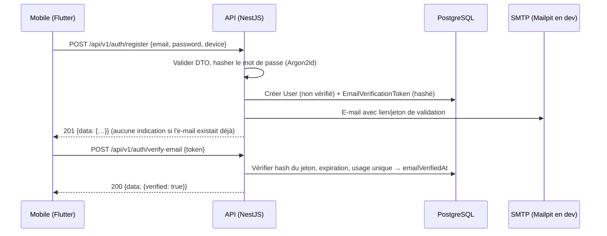
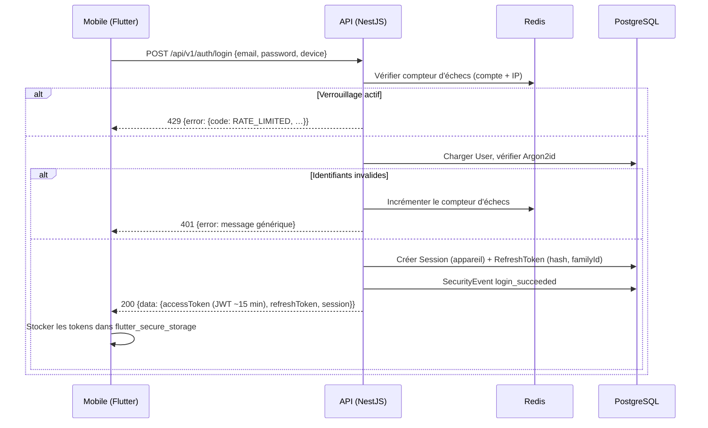
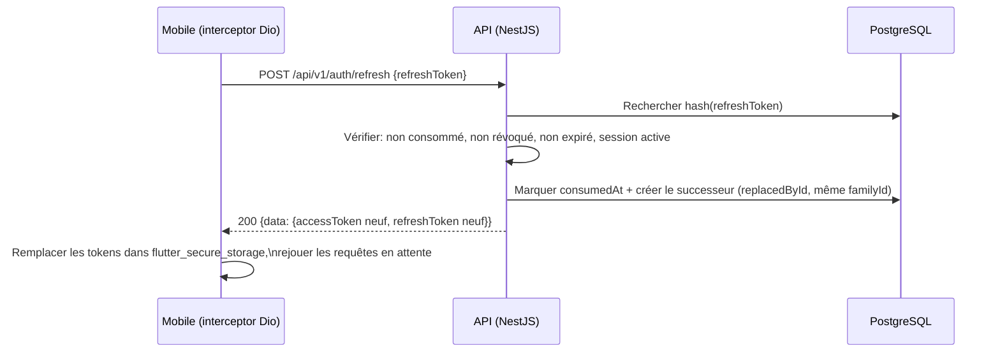
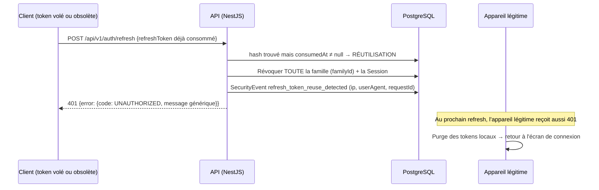

# Authentification — conception détaillée

> **Statut : conception validée — implémentation prévue à l'Étape 2.**
> Rien de ce qui est décrit ici n'existe encore dans le code (le schéma Prisma
> est vide à l'Étape 1). Ce document est la référence que l'implémentation de
> l'Étape 2 devra respecter ; tout écart devra être justifié ici même.

Ce document s'appuie sur les fondations déjà en place (Étape 1) : enveloppes de
réponse `{ data, meta, requestId }` / `{ error: { code, message, details, requestId } }`
(`packages/api-contracts`), versioning URI `/api/v1`, validation stricte des DTO,
rate limiting global, logs Pino corrélés au `requestId`, Redis (ioredis) et
Mailpit comme SMTP de développement.

---

## 1. Objectifs et principes

- **Access token JWT court (~15 minutes)** : porteur d'identité, jamais stocké
  côté serveur, vérifié à chaque requête (signature, expiration, `audience`,
  `issuer`).
- **Refresh token opaque rotatif** : valeur aléatoire à haute entropie, stockée
  **uniquement hashée** en base, liée à une **session par appareil**, tournée à
  chaque rafraîchissement.
- **Détection de réutilisation** : un refresh token déjà consommé qui réapparaît
  signale un vol probable → **révocation de toute la famille** de tokens.
- **Mots de passe en Argon2id**, jamais loggés, jamais retournés.
- **Moindre confiance côté client** : le mobile et l'admin ne détiennent jamais
  d'état d'autorisation faisant foi ; le serveur décide.
- **Extensible** : Sign in with Apple/Google dès l'Étape 2 via `ExternalIdentity` ;
  2FA ajoutable ultérieurement sans casser le modèle.

---

## 2. Modèle de données (Prisma — cible Étape 2)

Modèles prévus, à créer par migration à l'Étape 2. Les noms ci-dessous sont
**fonctionnels** (angle sécurité) ; les noms et le découpage de référence du
schéma Prisma cible sont fixés dans
[`docs/database/schema.md`](../database/schema.md) (section « Identité —
Étape 2 »). Correspondance : `Session` + `RefreshToken` ⇔ `UserSession`
(une ligne par maillon de rotation, `familyId` commun) ; `passwordHash` de
`User` ⇔ table dédiée `UserCredential` ; `EmailVerificationToken` ⇔
`EmailVerification` ; `PasswordResetToken` ⇔ `PasswordReset` ;
`SecurityEvent` ⇔ journal `AuditLog` du modèle cible (`actorType`, `requestId`,
métadonnées sans donnée sensible).

| Modèle | Rôle | Champs clés |
| --- | --- | --- |
| `User` | Compte utilisateur | `id` (UUID), `email` (citext, unique), `passwordHash` (Argon2id, nullable si compte social uniquement), `emailVerifiedAt`, `createdAt` |
| `ExternalIdentity` | Lien Apple / Google | `provider` (`apple` \| `google`), `providerUserId` (unique par provider), `userId`, `email` fourni par le provider |
| `Session` | Session par appareil | `id`, `userId`, `deviceName`, `devicePlatform`, `userAgent`, `ipCreated`, `createdAt`, `lastUsedAt`, `revokedAt` |
| `RefreshToken` | Maillon de la chaîne de rotation | `id`, `sessionId`, `tokenHash` (unique), `familyId`, `expiresAt`, `consumedAt`, `revokedAt`, `replacedById` |
| `EmailVerificationToken` | Validation d'e-mail | `tokenHash`, `userId`, `expiresAt`, `consumedAt` |
| `PasswordResetToken` | Mot de passe oublié | `tokenHash`, `userId`, `expiresAt`, `consumedAt` |
| `SecurityEvent` | Journal de sécurité | `type`, `userId?`, `sessionId?`, `ip`, `userAgent`, `requestId`, `createdAt`, `metadata` (sans donnée sensible) |

Notes :

- L'extension **citext** (déjà installée par
  `infrastructure/database/init/01-init.sql`) rend l'e-mail insensible à la casse.
- `familyId` regroupe tous les refresh tokens issus d'une même connexion sur une
  même session ; c'est l'unité de révocation en cas de réutilisation détectée.
- Un `RefreshToken` est stocké **hashé** (SHA-256 du token opaque — suffisant car
  le token a ≥ 256 bits d'entropie aléatoire ; Argon2 reste une alternative
  acceptée si l'on préfère un facteur de travail, au prix d'une recherche par
  identifiant plutôt que par hash). La valeur en clair n'est **jamais** persistée
  ni loggée.

---

## 3. Tokens

### 3.1 Access token (JWT)

| Propriété | Valeur cible |
| --- | --- |
| Durée de vie | ~15 minutes |
| Algorithme | asymétrique de préférence (ES256/RS256) ; secret dédié dans l'environnement, validé par `env.schema.ts` |
| `iss` (issuer) | identifiant de l'API Carlys — **vérifié** à chaque requête |
| `aud` (audience) | audience de l'API (ex. `carlys-api`) — **vérifiée** à chaque requête |
| `sub` | `User.id` |
| Claims additionnels | `sessionId` (permet la révocation ciblée), `email_verified` |

L'access token n'est **pas** stocké côté serveur ; sa révocation effective est
bornée par sa courte durée de vie. Les opérations sensibles (changement de mot
de passe, suppression de compte) revérifieront l'état de la session en base.

### 3.2 Refresh token (opaque, rotatif)

- Valeur aléatoire (≥ 32 octets CSPRNG), encodée URL-safe, **opaque** (aucune
  donnée embarquée).
- Stocké en base sous forme de **hash** (SHA-256, cf. §2), avec `familyId`,
  `sessionId`, `expiresAt` (durée de vie longue, par ex. 30 jours glissants).
- **Usage unique** : chaque appel à `/auth/refresh` marque le token
  `consumedAt`, en émet un nouveau (`replacedById`) et renvoie la nouvelle paire
  access + refresh.
- La présentation d'un token **déjà consommé ou révoqué** déclenche la
  **révocation de toute la famille** (voir séquence §7.4) et un `SecurityEvent`.

---

## 4. Parcours fonctionnels (Étape 2)

Endpoints cibles, tous sous `/api/v1/auth`, réponses conformes aux enveloppes
`api-contracts`, DTO en whitelist :

| Endpoint | Méthode | Rôle |
| --- | --- | --- |
| `/auth/register` | POST | Inscription e-mail + mot de passe ; envoi d'un e-mail de validation |
| `/auth/verify-email` | POST | Consommation du jeton de validation d'e-mail |
| `/auth/login` | POST | Connexion e-mail + mot de passe ; crée une session par appareil |
| `/auth/apple` / `/auth/google` | POST | Sign in with Apple / Google (vérification du jeton du provider côté serveur, liaison `ExternalIdentity`) |
| `/auth/refresh` | POST | Rotation du refresh token, nouvel access token |
| `/auth/logout` | POST | Révoque la session courante (et sa famille de tokens) |
| `/auth/forgot-password` | POST | Envoi d'un jeton de réinitialisation (réponse identique que l'e-mail existe ou non) |
| `/auth/reset-password` | POST | Consommation du jeton, nouveau mot de passe, révocation de toutes les sessions |
| `/auth/change-password` | POST | Changement authentifié ; exige le mot de passe actuel ; révoque les autres sessions |
| `/auth/sessions` | GET | Liste des appareils connectés (nom, plateforme, dernière activité) |
| `/auth/sessions/:id` | DELETE | Déconnexion ciblée d'un appareil |
| `/auth/sessions` | DELETE | Déconnexion globale (tous les appareils) |

### 4.1 Inscription et validation d'e-mail

- E-mail normalisé (citext), mot de passe soumis à une politique de robustesse
  vérifiée dans le DTO.
- Hash **Argon2id** (paramètres mémoire/itérations documentés dans le code et
  ajustables par configuration).
- Le compte est créé non vérifié ; un jeton de validation (usage unique,
  expiration courte, stocké hashé) est envoyé par e-mail — via **Mailpit** en
  développement (`docker compose up -d`, interface sur `http://localhost:8025`).
- La réponse d'inscription ne divulgue pas si l'e-mail existait déjà
  (message générique + e-mail « ce compte existe déjà » au titulaire réel).

### 4.2 Connexion

- Vérification Argon2id ; en cas d'échec, message générique
  (« identifiants invalides ») sans distinguer e-mail inconnu / mot de passe
  erroné.
- Création d'une `Session` (appareil déclaré par le client : nom, plateforme)
  et de la première paire access + refresh (nouvelle `familyId`).
- `SecurityEvent` `login_succeeded` / `login_failed`.

### 4.3 Sign in with Apple et Google

- Le client obtient un jeton d'identité auprès du provider ; l'API le **vérifie
  côté serveur** (signature via les clés publiques du provider, `aud`, `iss`,
  expiration, nonce).
- Correspondance par `ExternalIdentity (provider, providerUserId)` ;
  création du `User` au premier passage. La liaison à un compte e-mail existant
  exige que l'e-mail du provider soit vérifié.
- Ensuite, même mécanique de session et de tokens que la connexion classique.

### 4.4 Mot de passe oublié / changement

- `forgot-password` répond **toujours pareil** (pas d'énumération d'e-mails) ;
  jeton à usage unique, expiration courte, stocké hashé.
- `reset-password` et `change-password` **révoquent toutes les sessions**
  (sauf, pour `change-password`, la session courante) et journalisent un
  `SecurityEvent`.

### 4.5 Limitation de tentatives et verrouillage

- En complément du rate limiting global (100 req/60 s), les endpoints
  d'authentification reçoivent des **limites dédiées plus strictes**
  (throttler par route).
- **Compteur d'échecs par compte et par IP dans Redis** ; au-delà du seuil,
  **verrouillage temporaire** avec backoff progressif. Réponse `RATE_LIMITED`
  sans révéler l'état du compte. `SecurityEvent` `account_locked`.

### 4.6 Journalisation des événements de sécurité

Événements persistés (`SecurityEvent`) et loggés (Pino, corrélés au
`requestId`) : inscription, validation d'e-mail, connexions réussies/échouées,
verrouillage, rafraîchissements, **réutilisation de refresh token détectée**,
révocations (ciblée/globale), réinitialisations et changements de mot de passe,
liaison d'identité externe. **Jamais** de mot de passe, de token en clair ni de
hash dans ces journaux — les en-têtes `authorization` et `cookie` sont déjà
rédigés par la configuration Pino de l'Étape 1.

### 4.7 2FA — extensibilité

Le modèle réserve l'ajout ultérieur d'un second facteur (TOTP en premier
candidat) : table dédiée, étape intermédiaire au login (jeton de défi court
avant émission des tokens), codes de récupération hashés. **Non implémenté à
l'Étape 2** — l'architecture ne doit simplement pas l'empêcher.

---

## 5. Côté mobile (Flutter)

- **Stockage des tokens exclusivement dans `flutter_secure_storage`**
  (Keychain iOS / Keystore Android). **Jamais** SharedPreferences, jamais un
  fichier en clair, jamais la base Drift.
- **Renouvellement automatique via un interceptor Dio** :
  1. sur réponse `401`, l'interceptor suspend les requêtes en attente ;
  2. un **seul** appel `/auth/refresh` est émis (verrou anti-concurrence) ;
  3. succès → les tokens sont remplacés dans `flutter_secure_storage` et les
     requêtes suspendues sont rejouées ;
  4. échec (famille révoquée, session expirée) → purge des tokens locaux et
     retour à l'écran de connexion (GoRouter).
- L'identité de l'appareil (nom, plateforme) est envoyée à la connexion pour
  alimenter la liste des sessions.

Le tableau de bord admin n'est pas concerné ici : l'authentification admin
(rôles, permissions, audit) arrive à l'**Étape 7** — `/login` n'est aujourd'hui
qu'un emplacement documenté sans fausse authentification.

---

## 6. Erreurs

Toutes les erreurs respectent l'enveloppe existante
`{ error: { code, message, details, requestId } }` avec des messages
**génériques** sur les parcours sensibles : pas d'énumération d'e-mails, pas de
distinction e-mail/mot de passe, pas d'indication qu'un compte est verrouillé
au-delà du code `RATE_LIMITED`.

---

## 7. Séquences

### 7.1 Inscription avec validation d'e-mail

### 7.2 Connexion (création de session par appareil)

### 7.3 Rafraîchissement (rotation)

### 7.4 Réutilisation détectée (révocation de la famille)

---

## 8. Check-list de conformité pour l'Étape 2

À vérifier en revue avant de déclarer l'Étape 2 terminée :

- [ ] Argon2id partout ; aucun mot de passe/hash dans les logs ou les réponses.
- [ ] JWT ~15 min ; `aud` et `iss` vérifiés ; secret/clé validé par `env.schema.ts`.
- [ ] Refresh opaque, hashé en base, usage unique, rotation systématique.
- [ ] Réutilisation → révocation de la famille + `SecurityEvent` + test e2e dédié.
- [ ] Sessions par appareil : liste, déconnexion ciblée, déconnexion globale.
- [ ] Limites de tentatives dédiées + verrouillage temporaire (Redis) testés.
- [ ] Aucune énumération d'e-mails (register, login, forgot-password).
- [ ] Mobile : `flutter_secure_storage` uniquement ; interceptor Dio avec verrou
      anti-concurrence testé (un seul refresh simultané).
- [ ] Migrations Prisma écrites ; `prisma validate` et la détection de
      migrations manquantes passent en CI.
- [ ] `SECURITY.md` mis à jour : les engagements « cible (Étape 2) » passent
      « en place ».
