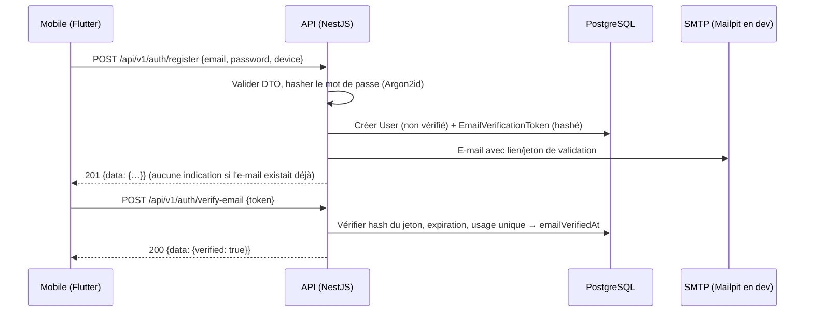
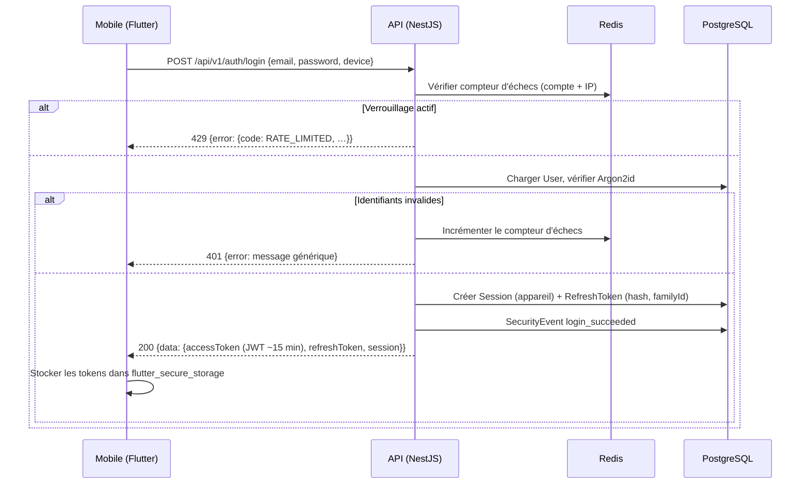
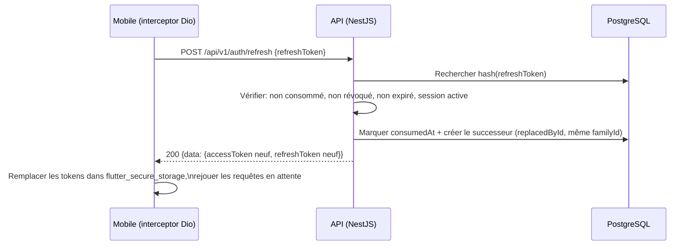
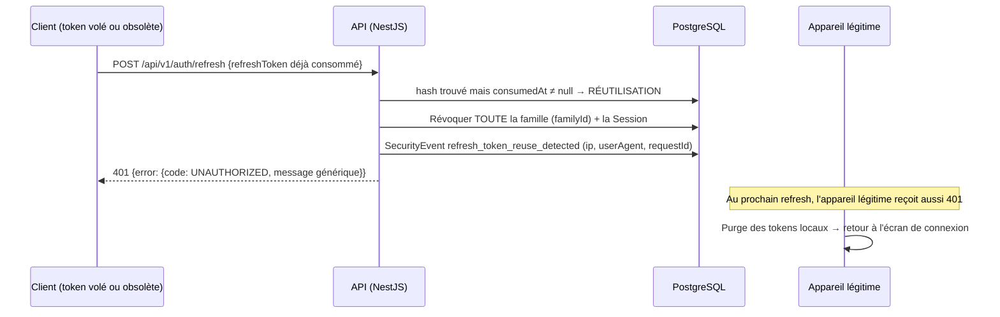

# Authentification — conception détaillée

> **Statut : implémenté (Étape 2)** — modules `apps/api/src/modules/auth`,
> `users`, `audit`, guard global `src/common/guards/jwt-auth.guard.ts`,
> migration `20260806180000_auth_foundation`.
>
> Écarts et précisions de l'implémentation par rapport à la conception :
>
> - **Modèles réels** : `UserSession` (session par appareil) + `RefreshToken`
>   (une ligne par jeton, hash SHA-256 unique, statuts
>   `ACTIVE | ROTATED | REVOKED`). La « famille » de la conception correspond
>   à la session : réutilisation détectée → révocation de la session entière.
>   Pas de `UserDevice` : les métadonnées d'appareil (nom, plateforme, IP,
>   user-agent) vivent sur la session, et le jeton push (`DeviceToken`) est
>   rattaché à la session qui l'a enregistré (`sessionId`, migration
>   `20260926200000_jetons_push_par_session`) : révoquer la session supprime
>   ses jetons dans la même transaction (`SessionsRepository.revokeSession`,
>   `revokeAllSessions`), et une session expirée n'en reçoit plus
>   (`DeviceTokensRepository.listTokens`).
> - **Rotation conditionnelle** : la rotation n'aboutit que si le jeton est
>   encore `ACTIVE` (mise à jour conditionnelle en transaction) ; deux refresh
>   concurrents du même jeton → le second est traité comme une réutilisation.
> - **Révocation immédiate** : le guard vérifie le JWT (signature, expiration,
>   `issuer`, `audience`) **puis** l'état de la session en base — révoquer une
>   session invalide ses access tokens sans attendre leur expiration.
> - **Verrouillage** : compteur Redis par e-mail normalisé, fenêtre reposée à
>   chaque échec ; si Redis est indisponible, fail-open journalisé (le rate
>   limiting HTTP global reste actif). La connexion du **back-office**
>   (`POST /admin/auth/login`) applique le même `LockoutService` avec un
>   compteur distinct (`admin:<e-mail>`) : au-delà de
>   `AUTH_MAX_LOGIN_ATTEMPTS`, réponse `429 RATE_LIMITED` avant toute lecture
>   du compte, sans rien révéler de son existence ni de son état
>   (`admin.login_blocked_lockout` dans l'audit).
> - **Suppression de compte** (`DELETE /users/me`) : en une transaction,
>   sessions supprimées avec leurs refresh tokens (leurs adresse IP,
>   user-agent et nom d'appareil partent avec le compte), compte `DELETED`,
>   adresse et code ami réécrits en valeurs tombales, profil personnel
>   effacé, jetons d'appareil et identités externes supprimés ; l'adresse
>   d'origine est de nouveau disponible pour une inscription. Un compte sans
>   mot de passe (né d'une connexion Apple ou Google) reçoit **409** et est
>   renvoyé à « Mot de passe oublié ». L'historique est effacé 30 jours plus
>   tard par `dist/cli/deleted-accounts-purge` (détail et données
>   conservées : `SECURITY.md`).
> - **Connexion Apple et Google** : livrée, `POST /auth/social` (§4.3).
> - **Reste à venir** : 2FA.

Ce document s'appuie sur les fondations déjà en place (Étape 1) : enveloppes de
réponse `{ data, meta, requestId }` / `{ error: { code, message, details, requestId } }`
(`packages/api-contracts`), versioning URI `/api/v1`, validation stricte des DTO,
rate limiting global, logs Pino corrélés au `requestId`, Redis (ioredis) et
Mailpit comme SMTP de développement.

---

## 1. Objectifs et principes

- **Access token JWT court (~15 minutes)** : porteur d'identité, jamais stocké
  côté serveur, vérifié à chaque requête (signature, expiration, `audience`,
  `issuer`).
- **Refresh token opaque rotatif** : valeur aléatoire à haute entropie, stockée
  **uniquement hashée** en base, liée à une **session par appareil**, tournée à
  chaque rafraîchissement.
- **Détection de réutilisation** : un refresh token déjà consommé qui réapparaît
  signale un vol probable → **révocation de toute la famille** de tokens.
- **Mots de passe en Argon2id**, jamais loggés, jamais retournés.
- **Moindre confiance côté client** : le mobile et l'admin ne détiennent jamais
  d'état d'autorisation faisant foi ; le serveur décide.
- **Extensible** : Sign in with Apple/Google dès l'Étape 2 via `ExternalIdentity` ;
  2FA ajoutable ultérieurement sans casser le modèle.

---

## 2. Modèle de données (Prisma — cible Étape 2)

Modèles prévus, à créer par migration à l'Étape 2. Les noms ci-dessous sont
**fonctionnels** (angle sécurité) ; les noms et le découpage de référence du
schéma Prisma cible sont fixés dans
[`docs/database/schema.md`](../database/schema.md) (section « Identité —
Étape 2 »). Correspondance : `Session` + `RefreshToken` ⇔ `UserSession`
(une ligne par maillon de rotation, `familyId` commun) ; `passwordHash` de
`User` ⇔ table dédiée `UserCredential` ; `EmailVerificationToken` ⇔
`EmailVerification` ; `PasswordResetToken` ⇔ `PasswordReset` ;
`SecurityEvent` ⇔ journal `AuditLog` du modèle cible (`actorType`, `requestId`,
métadonnées sans donnée sensible).

| Modèle | Rôle | Champs clés |
| --- | --- | --- |
| `User` | Compte utilisateur | `id` (UUID), `email` (citext, unique), `passwordHash` (Argon2id, nullable si compte social uniquement), `emailVerifiedAt`, `createdAt` |
| `ExternalIdentity` | Lien Apple / Google (réel : `schema.prisma`) | `provider` (`APPLE` \| `GOOGLE`), `subject` (claim `sub`, unique par provider), `userId`, `email` fourni par le provider, `createdAt` |
| `Session` | Session par appareil | `id`, `userId`, `deviceName`, `devicePlatform`, `userAgent`, `ipCreated`, `createdAt`, `lastUsedAt`, `revokedAt` |
| `RefreshToken` | Maillon de la chaîne de rotation | `id`, `sessionId`, `tokenHash` (unique), `familyId`, `expiresAt`, `consumedAt`, `revokedAt`, `replacedById` |
| `EmailVerificationToken` | Validation d'e-mail | `tokenHash`, `userId`, `expiresAt`, `consumedAt` |
| `PasswordResetToken` | Mot de passe oublié | `tokenHash`, `userId`, `expiresAt`, `consumedAt` |
| `SecurityEvent` | Journal de sécurité | `type`, `userId?`, `sessionId?`, `ip`, `userAgent`, `requestId`, `createdAt`, `metadata` (sans donnée sensible) |

Notes :

- Réel : l'e-mail est un `String @unique` ordinaire, rendu insensible à la
  casse par la couche application (`normalizeEmail` : `trim` puis
  minuscules, avant toute lecture ou écriture). L'extension **citext**,
  installée par `infrastructure/database/init/01-init.sql`, n'est portée
  par aucune colonne.
- `familyId` regroupe tous les refresh tokens issus d'une même connexion sur une
  même session ; c'est l'unité de révocation en cas de réutilisation détectée.
- Un `RefreshToken` est stocké **hashé** (SHA-256 du token opaque — suffisant car
  le token a ≥ 256 bits d'entropie aléatoire ; Argon2 reste une alternative
  acceptée si l'on préfère un facteur de travail, au prix d'une recherche par
  identifiant plutôt que par hash). La valeur en clair n'est **jamais** persistée
  ni loggée.

---

## 3. Tokens

### 3.1 Access token (JWT)

| Propriété | Valeur cible |
| --- | --- |
| Durée de vie | ~15 minutes |
| Algorithme | asymétrique de préférence (ES256/RS256) ; secret dédié dans l'environnement, validé par `env.schema.ts` |
| `iss` (issuer) | identifiant de l'API Carlys — **vérifié** à chaque requête |
| `aud` (audience) | audience de l'API (ex. `carlys-api`) — **vérifiée** à chaque requête |
| `sub` | `User.id` |
| Claims additionnels | `sessionId` (permet la révocation ciblée), `email_verified` |

L'access token n'est **pas** stocké côté serveur ; sa révocation effective est
bornée par sa courte durée de vie. Les opérations sensibles (changement de mot
de passe, suppression de compte) revérifieront l'état de la session en base.

### 3.2 Refresh token (opaque, rotatif)

- Valeur aléatoire (≥ 32 octets CSPRNG), encodée URL-safe, **opaque** (aucune
  donnée embarquée).
- Stocké en base sous forme de **hash** (SHA-256, cf. §2), avec `familyId`,
  `sessionId`, `expiresAt` (durée de vie longue, par ex. 30 jours glissants).
- **Usage unique** : chaque appel à `/auth/refresh` marque le token
  `consumedAt`, en émet un nouveau (`replacedById`) et renvoie la nouvelle paire
  access + refresh.
- La présentation d'un token **déjà consommé ou révoqué** déclenche la
  **révocation de toute la famille** (voir séquence §7.4) et un `SecurityEvent`.

---

## 4. Parcours fonctionnels (Étape 2)

Endpoints cibles, tous sous `/api/v1/auth`, réponses conformes aux enveloppes
`api-contracts`, DTO en whitelist :

| Endpoint | Méthode | Rôle |
| --- | --- | --- |
| `/auth/register` | POST | Inscription e-mail + mot de passe ; envoi d'un e-mail de validation |
| `/auth/verify-email` | POST | Consommation du jeton de validation d'e-mail |
| `/auth/login` | POST | Connexion e-mail + mot de passe ; crée une session par appareil |
| `/auth/social` | POST | Connexion Apple ou Google (`provider`, `idToken`) : vérification du jeton d'identité côté serveur, liaison `ExternalIdentity`, création du compte au besoin |
| `/auth/refresh` | POST | Rotation du refresh token, nouvel access token |
| `/auth/logout` | POST | Révoque la session courante (et sa famille de tokens) |
| `/auth/forgot-password` | POST | Envoi d'un jeton de réinitialisation (réponse identique que l'e-mail existe ou non) |
| `/auth/reset-password` | POST | Consommation du jeton, nouveau mot de passe, révocation de toutes les sessions |
| `/auth/change-password` | POST | Changement authentifié ; exige le mot de passe actuel ; révoque les autres sessions |
| `/auth/sessions` | GET | Liste des appareils connectés (nom, plateforme, dernière activité) |
| `/auth/sessions/:id` | DELETE | Déconnexion ciblée d'un appareil |
| `/auth/sessions` | DELETE | Déconnexion globale (tous les appareils) |

Les jetons de `/auth/verify-email` et `/auth/reset-password` sont consommés
par les **pages web publiques** `/verify-email` et `/reset-password` de
l'application Next.js (`apps/admin`, sous `PUBLIC_APP_URL`), ouvertes depuis
le lien reçu par e-mail : dans le diagramme 7.1, l'acteur qui poste le jeton
est donc le navigateur, pas l'application mobile.

### 4.1 Inscription et validation d'e-mail

- E-mail normalisé (`normalizeEmail`), mot de passe soumis à une politique de robustesse
  vérifiée dans le DTO.
- Hash **Argon2id** (paramètres mémoire/itérations documentés dans le code et
  ajustables par configuration).
- Le compte est créé non vérifié ; un jeton de validation (usage unique,
  expiration courte, stocké hashé) est envoyé par e-mail — via **Mailpit** en
  développement (`docker compose up -d`, interface sur `http://localhost:8025`).
- La réponse d'inscription ne divulgue pas si l'e-mail existait déjà
  (message générique + e-mail « ce compte existe déjà » au titulaire réel).

### 4.2 Connexion

- Vérification Argon2id ; en cas d'échec, message générique
  (« identifiants invalides ») sans distinguer e-mail inconnu / mot de passe
  erroné.
- Création d'une `Session` (appareil déclaré par le client : nom, plateforme)
  et de la première paire access + refresh (nouvelle `familyId`).
- `SecurityEvent` `login_succeeded` / `login_failed`.

### 4.3 Sign in with Apple et Google

- Le client obtient un jeton d'identité auprès du provider et le poste à
  `POST /auth/social`. L'API le **vérifie côté serveur**
  (`SocialTokenVerifier`) : signature par les clés publiques du provider
  (JWKS), `iss`, `aud` (`GOOGLE_OAUTH_CLIENT_IDS`, `APPLE_OAUTH_AUDIENCES`),
  claims `sub`, `iat` et `exp` exigés, âge maximal du jeton, tolérance
  d'horloge. Sans audience configurée : 503.
- **Pas de nonce.** Le mobile n'en envoie pas et le serveur n'en compare
  aucun. Risque accepté : un jeton d'identité volé pourrait être rejoué
  pendant sa courte vie (`exp`, plus l'âge maximal), et seulement vers une
  audience qui est la nôtre. L'ajouter demande un nonce généré par
  l'application, passé au SDK, puis comparé côté serveur.
- Trois issues, dans l'ordre : identité `ExternalIdentity (provider, subject)`
  connue → connexion ; adresse d'un compte existant, **vérifiée par le
  provider** → rattachement ; sinon création d'un compte SANS mot de passe,
  adresse marquée vérifiée. Sans adresse vérifiée par le provider : 401, rien
  n'est créé ni rattaché.
- **Reprise d'un compte non vérifié** : si le compte existant n'avait jamais
  prouvé son adresse, le provider vient de le faire. Ses sessions sont
  révoquées (avec leurs jetons push), sa crédential supprimée et ses liens de
  réinitialisation invalidés (`auth.social_claimed_unverified_account`).
- Ensuite, même mécanique de session et de tokens que la connexion classique.
- Guide de mise en route et dépannage : `docs/deployment/connexion-sociale.md`.

### 4.4 Mot de passe oublié / changement

- `forgot-password` répond **toujours pareil** (pas d'énumération d'e-mails) ;
  jeton à usage unique, expiration courte, stocké hashé.
- **Cadence par compte** de `forgot-password` (`password-reset-cadence.ts`) :
  un lien par minute au plus, cinq par fenêtre égale à la validité d'un lien
  (`PASSWORD_RESET_TTL_MINUTES`), comptés sous un verrou PostgreSQL par
  compte. Au-delà, rien ne part, et la réponse reste la même (202). Sans
  elle, la limite par IP seule laissait n'importe qui inonder une adresse
  inscrite de vrais courriers en multipliant les IP. Les liens ne
  s'invalident PAS entre eux (la demande est anonyme : invalider laisserait
  n'importe qui casser le lien qu'on s'apprête à ouvrir) ; ils tombent tous
  dès que l'un sert, ou que le mot de passe change.
- `reset-password` et `change-password` **révoquent toutes les sessions**
  (sauf, pour `change-password`, la session courante) et journalisent un
  `SecurityEvent`.

### 4.5 Limitation de tentatives et verrouillage

- En complément du rate limiting global (100 req/60 s), les endpoints
  d'authentification reçoivent des **limites dédiées plus strictes**
  (throttler par route).
- **Compteur d'échecs par compte et par IP dans Redis** ; au-delà du seuil,
  **verrouillage temporaire** avec backoff progressif. Réponse `RATE_LIMITED`
  sans révéler l'état du compte. `SecurityEvent` `account_locked`.
- **Re-authentification d'une session** (`POST /auth/change-password`,
  `DELETE /users/me`) : même seuil et même durée que la connexion
  (`AUTH_MAX_LOGIN_ATTEMPTS`, `AUTH_LOCKOUT_MINUTES`), sur un compteur À PART
  (`reauth:<userId>`, `ReauthenticationService`) — sinon qui tient une session
  volée pourrait verrouiller la connexion du propriétaire. Sans ce
  verrouillage, ces deux routes étaient un oracle de mot de passe à 100 essais
  par minute et par IP, sans plafond par compte. Le 429 est rendu AVANT toute
  vérification Argon2, même pour un mot de passe juste. Limite par IP :
  10/min (`STRICT_THROTTLE`). Une réinitialisation du mot de passe par
  e-mail remet À ZÉRO ce compteur, comme celui de la connexion : le
  propriétaire qui reprend son compte a prouvé qu'il tient la boîte mail, et
  les essais faux du voleur qu'il vient de chasser ne lui interdisent plus
  de changer son mot de passe ou de supprimer son compte.
- **L'essai est RÉSERVÉ avant la vérification** (`LockoutService.reserveAttempt`,
  un `INCR` Redis atomique), à la connexion mobile, à celle du back-office et
  à la re-authentification : parmi N essais simultanés venus de N adresses IP,
  exactement `AUTH_MAX_LOGIN_ATTEMPTS` sont vérifiés, les autres reçoivent
  429. Lire le compteur puis compter l'échec après coup laissait passer toute
  une rafale (mesuré : 25 vérifications sur 30 essais parallèles, pour un
  seuil de 5). Un succès remet le compteur à zéro ; un essai refusé ne
  prolonge pas le verrouillage. `test/auth-plafonds-par-compte.e2e-spec.ts`.
- **Renvoi du lien de vérification** : un lien par minute au plus, cinq par
  24 h, par compte ; chaque lien invalide les précédents ; limite par IP :
  3 appels / 10 min. La réponse reste 204 dans tous les cas.
- **Plafond par ADRESSE** (`EmailService`, `LINKS_PER_ADDRESS`) : cinq liens
  au plus vers une même adresse, tous comptes confondus — par 24 h pour la
  vérification, par durée de validité d'un lien pour la réinitialisation.
  Les cadences par compte ne voyaient pas la rotation des comptes :
  « s'inscrire avec l'adresse d'une victime, puis supprimer le compte », en
  boucle, repartait chaque fois d'une cadence neuve (mesuré : 8 tours,
  8 courriers). Compté dans Redis sous l'empreinte à clé de l'adresse,
  jamais en clair ; un lien refusé ne change rien à la réponse HTTP (pas
  d'oracle) ; Redis injoignable, le lien part et c'est journalisé.
- **Journaux** : l'API n'écrit pas d'adresse e-mail en clair — le
  destinataire d'un courrier, l'identifiant d'un verrouillage et l'adresse
  saisie lors d'une connexion échouée, mobile ou back-office
  (`auth.login_failed`, `auth.login_blocked_lockout`, `admin.login_failed`,
  `admin.login_blocked_lockout`, `metadata.emailHash` dans l'audit) n'y
  figurent que par une empreinte à clé : un HMAC-SHA-256 tronqué
  (`common/utilities/log-privacy.ts`), sous une clé dérivée de
  `JWT_ACCESS_SECRET` (`AppConfigService.logFingerprintKey`), que seul le
  serveur tient — un SHA-256 nu se renversait par dictionnaire. Une exception, non masquée : la
  ligne de requête. Pino (`req.url`, `req.query`) et le journal d'accès
  Nginx la recopient telle quelle ; quand un administrateur cherche un
  compte par son adresse dans le back-office
  (`GET /admin/users?search=…`), l'adresse y figure donc en clair.

### 4.6 Journalisation des événements de sécurité

Événements persistés (`SecurityEvent`) et loggés (Pino, corrélés au
`requestId`) : inscription, validation d'e-mail, connexions réussies/échouées,
verrouillage, rafraîchissements, **réutilisation de refresh token détectée**,
révocations (ciblée/globale), réinitialisations et changements de mot de passe,
liaison d'identité externe. **Jamais** de mot de passe, de token en clair ni de
hash dans ces journaux — les en-têtes `authorization` et `cookie` sont déjà
rédigés par la configuration Pino de l'Étape 1. L'adresse saisie lors d'un
échec de connexion n'entre dans l'audit qu'en empreinte (`emailHash`) :
l'audit survit à la suppression et à la purge du compte, l'adresse ne doit
pas y survivre avec lui.

### 4.7 2FA — extensibilité

Le modèle réserve l'ajout ultérieur d'un second facteur (TOTP en premier
candidat) : table dédiée, étape intermédiaire au login (jeton de défi court
avant émission des tokens), codes de récupération hashés. **Non implémenté à
l'Étape 2** — l'architecture ne doit simplement pas l'empêcher.

---

## 5. Côté mobile (Flutter)

- **Stockage des tokens exclusivement dans `flutter_secure_storage`**
  (Keychain iOS / Keystore Android). **Jamais** SharedPreferences, jamais un
  fichier en clair, jamais la base Drift.
- **Renouvellement automatique via un interceptor Dio** :
  1. sur réponse `401`, l'interceptor suspend les requêtes en attente ;
  2. un **seul** appel `/auth/refresh` est émis (verrou anti-concurrence) ;
  3. succès → les tokens sont remplacés dans `flutter_secure_storage` et les
     requêtes suspendues sont rejouées ;
  4. échec (famille révoquée, session expirée) → purge des tokens locaux et
     retour à l'écran de connexion (GoRouter).
- L'identité de l'appareil (nom, plateforme) est envoyée à la connexion pour
  alimenter la liste des sessions.

- À l'expiration de la session (refresh refusé), l'application oublie aussi
  son jeton push (`PushRegistration.forgetLocally`) : effacé chez FCM, SANS
  appel à l'API, puisqu'il n'y a plus de session pour lui parler. Le serveur
  ne le sert déjà plus : `DeviceTokensRepository.listTokens` ne rend que les
  jetons d'une session ni révoquée ni expirée (un jeton antérieur au
  rattachement aux sessions, `sessionId` nul, reste servi : c'est
  l'effacement chez FCM qui le rend inutilisable). Le compte suivant en
  réenregistre un.

Le tableau de bord admin a sa propre authentification (Étape 7, comptes admin
séparés, rôles et permissions, audit) : `docs/architecture/admin.md`.

---

## 6. Erreurs

Toutes les erreurs respectent l'enveloppe existante
`{ error: { code, message, details, requestId } }` avec des messages
**génériques** sur les parcours sensibles : pas d'énumération d'e-mails, pas de
distinction e-mail/mot de passe, pas d'indication qu'un compte est verrouillé
au-delà du code `RATE_LIMITED`.

---

## 7. Séquences

### 7.1 Inscription avec validation d'e-mail

```mermaid
sequenceDiagram
    participant M as Mobile (Flutter)
    participant A as API (NestJS)
    participant DB as PostgreSQL
    participant S as SMTP (Mailpit en dev)

    M->>A: POST /api/v1/auth/register {email, password, device}
    A->>A: Valider DTO, hasher le mot de passe (Argon2id)
    A->>DB: Créer User (non vérifié) + EmailVerificationToken (hashé)
    A->>S: E-mail avec lien/jeton de validation
    A-->>M: 201 {data: {…}} (aucune indication si l'e-mail existait déjà)
    M->>A: POST /api/v1/auth/verify-email {token}
    A->>DB: Vérifier hash du jeton, expiration, usage unique → emailVerifiedAt
    A-->>M: 200 {data: {verified: true}}
```

### 7.2 Connexion (création de session par appareil)

```mermaid
sequenceDiagram
    participant M as Mobile (Flutter)
    participant A as API (NestJS)
    participant R as Redis
    participant DB as PostgreSQL

    M->>A: POST /api/v1/auth/login {email, password, device}
    A->>R: Vérifier compteur d'échecs (compte + IP)
    alt Verrouillage actif
        A-->>M: 429 {error: {code: RATE_LIMITED, …}}
    else
        A->>DB: Charger User, vérifier Argon2id
        alt Identifiants invalides
            A->>R: Incrémenter le compteur d'échecs
            A-->>M: 401 {error: message générique}
        else
            A->>DB: Créer Session (appareil) + RefreshToken (hash, familyId)
            A->>DB: SecurityEvent login_succeeded
            A-->>M: 200 {data: {accessToken (JWT ~15 min), refreshToken, session}}
            M->>M: Stocker les tokens dans flutter_secure_storage
        end
    end
```

### 7.3 Rafraîchissement (rotation)

```mermaid
sequenceDiagram
    participant M as Mobile (interceptor Dio)
    participant A as API (NestJS)
    participant DB as PostgreSQL

    M->>A: POST /api/v1/auth/refresh {refreshToken}
    A->>DB: Rechercher hash(refreshToken)
    A->>A: Vérifier: non consommé, non révoqué, non expiré, session active
    A->>DB: Marquer consumedAt + créer le successeur (replacedById, même familyId)
    A-->>M: 200 {data: {accessToken neuf, refreshToken neuf}}
    M->>M: Remplacer les tokens dans flutter_secure_storage,\nrejouer les requêtes en attente
```

### 7.4 Réutilisation détectée (révocation de la famille)

```mermaid
sequenceDiagram
    participant X as Client (token volé ou obsolète)
    participant A as API (NestJS)
    participant DB as PostgreSQL
    participant M as Appareil légitime

    X->>A: POST /api/v1/auth/refresh {refreshToken déjà consommé}
    A->>DB: hash trouvé mais consumedAt ≠ null → RÉUTILISATION
    A->>DB: Révoquer TOUTE la famille (familyId) + la Session
    A->>DB: SecurityEvent refresh_token_reuse_detected (ip, userAgent, requestId)
    A-->>X: 401 {error: {code: UNAUTHORIZED, message générique}}
    Note over M: Au prochain refresh, l'appareil légitime reçoit aussi 401
    M->>M: Purge des tokens locaux → retour à l'écran de connexion
```

---

## 8. Check-list de conformité pour l'Étape 2

À vérifier en revue avant de déclarer l'Étape 2 terminée :

- [ ] Argon2id partout ; aucun mot de passe/hash dans les logs ou les réponses.
- [ ] JWT ~15 min ; `aud` et `iss` vérifiés ; secret/clé validé par `env.schema.ts`.
- [ ] Refresh opaque, hashé en base, usage unique, rotation systématique.
- [ ] Réutilisation → révocation de la famille + `SecurityEvent` + test e2e dédié.
- [ ] Sessions par appareil : liste, déconnexion ciblée, déconnexion globale.
- [ ] Limites de tentatives dédiées + verrouillage temporaire (Redis) testés.
- [ ] Aucune énumération d'e-mails sur **login** et **forgot-password**.
      `register` fait exception, ASSUMÉE : il rend un `409` explicite
      (« un compte existe déjà avec cette adresse »), parce qu'une inscription
      silencieusement refusée laisse la personne devant un formulaire qui ne
      marche pas sans lui dire pourquoi, et qu'un `register` non énumérant
      devrait cesser de rendre des jetons — donc changer tout le parcours
      d'inscription. L'atténuation est le débit : `register` porte le même
      `STRICT_THROTTLE` que `login`. Deux tests figent ce `409`
      (`auth.e2e-spec.ts`, `auth.service.spec.ts`) : le changer est une
      décision produit, pas un correctif.
- [ ] Mobile : `flutter_secure_storage` uniquement ; interceptor Dio avec verrou
      anti-concurrence testé (un seul refresh simultané).
- [ ] Migrations Prisma écrites ; `prisma validate` et la détection de
      migrations manquantes passent en CI.
- [ ] `SECURITY.md` mis à jour : les engagements « cible (Étape 2) » passent
      « en place ».
