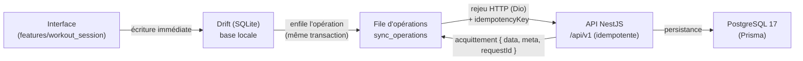
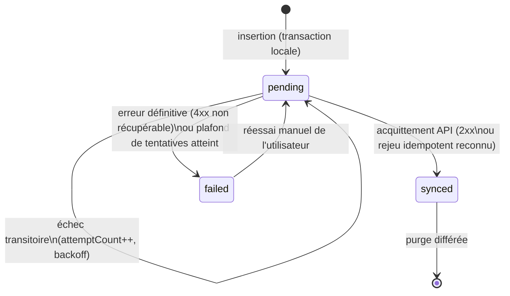

# Stratégie offline-first — synchronisation des données

> **Statut : implémenté (Étape 4)** pour les séances — Drift dans
> `apps/mobile/lib/core/database/app_database.dart`, file et moteur dans
> `apps/mobile/lib/core/synchronization/` (`sync_engine.dart`,
> `sync_lifecycle.dart`, `sync_api.dart`), écritures locales dans
> `features/workout_session/data/`, endpoints idempotents dans le module API
> `workout_sessions`.
>
> Paramètres effectifs de l'implémentation :
>
> - table locale `sync_operations` avec exactement les colonnes décrites plus
>   bas ; **une opération réussie est supprimée** (l'état `synced` vit sur
>   l'entité), `failed` est réservé aux refus définitifs du serveur (4xx) ;
> - **FIFO strict** : la file est rejouée dans l'ordre d'écriture locale ; un
>   échec réseau interrompt le drainage (aucune opération ne double une autre) ;
> - **backoff exponentiel** par opération : 5 s, 10 s, 20 s… plafonné à 5 min ;
> - déclencheurs : entrée dans l'application, retour de connectivité
>   (`connectivity_plus`), périodique (3 min), et opportuniste après chaque
>   écriture locale ;
> - **l'id de l'entité (UUID généré sur l'appareil) est la clé d'idempotence** :
>   les endpoints `workout-sessions`/`workout-sets` sont rejouables sans doublon
>   (vérifié par les tests e2e côté API et la suite
>   `test/features/workout/workout_offline_sync_test.dart` côté mobile) ;
> - un refus serveur 4xx marque l'opération et l'entité `failed` sans bloquer
>   le reste de la file ; 401/5xx/réseau ⇒ nouvel essai plus tard ;
> - la **récupération multi-appareils** est assurée par un rapatriement au
>   démarrage (`AppRestore`), pendant en LECTURE de la file : il retire du
>   serveur les modèles, puis les séances avec leurs séries et leur plan.

## Opérations de la file

| `operationType`    | `entityType` | Appel HTTP                             |
| ------------------ | ------------ | -------------------------------------- |
| `session.create`   | `session`    | `POST /workout-sessions`               |
| `session.complete` | `session`    | `POST /workout-sessions/{id}/complete` |
| `session.abandon`  | `session`    | `POST /workout-sessions/{id}/abandon`  |
| `set.upsert`       | `set`        | `POST /workout-sessions/{id}/sets`     |
| `set.delete`       | `set`        | `DELETE /workout-sets/{id}`            |
| `plan.skip`        | `plan`       | `POST /workout-sessions/{id}/plan/skip`|
| `template.save`    | `template`   | `PUT /workout-templates/{id}`          |
| `template.delete`  | `template`   | `DELETE /workout-templates/{id}`       |

Les **modèles de séance**
([docs/product/workout-templates.md](../product/workout-templates.md)) suivent
exactement le même protocole, avec deux particularités :

- `template.save` transporte l'**état complet** du modèle : l'idempotence est
  naturelle (rejouer le même corps donne le même état), et une sauvegarde
  encore `pending` est *remplacée* par la suivante plutôt que d'empiler N
  opérations pendant l'édition ;
- le **plan de la séance en cours** (`LocalSessionPlanItems`, copie aplatie du
  modèle au lancement) est synchronisé **sans opération dédiée**, sauf pour les
  séries passées : il part en bloc dans le corps de `session.create`, et
  l'appariement série ↔ prévision voyage dans le corps de `set.upsert`
  (`planItemId`). Seul « passer une série » a son opération, `plan.skip`, dont
  le corps porte la liste complète — donc naturellement rejouable. C'est ce qui
  permet de reprendre sur un autre appareil une séance commencée ailleurs, avec
  ses cibles (voir D5 dans
  [docs/product/workout-templates.md](../product/workout-templates.md)).

Lancer un modèle fonctionne **intégralement hors ligne** : la séance, son plan
et l'opération `session.create` sont écrits dans une seule transaction SQLite,
sans le moindre appel réseau. Et si `template.save` a été refusée
définitivement par le serveur, la séance part quand même : l'API ignore alors
le `templateId` inconnu et conserve le `templateName` transmis. **Aucune séance
n'est jamais perdue à cause d'un modèle.**

## Objectif

Une séance d'entraînement se déroule souvent dans une salle de sport : réseau
absent, instable ou coupé en plein milieu. La règle est simple :

- **une séance reste utilisable de bout en bout sans réseau** — démarrage,
  saisie des séries, minuteur, clôture ;
- **aucune série saisie n'est jamais perdue**, quelles que soient les coupures,
  fermetures brutales ou resoumissions.

Le réseau est une optimisation, pas un prérequis. La source de vérité immédiate
pour l'utilisateur est la base locale ; PostgreSQL devient la source de vérité
durable une fois la synchronisation effectuée.

## Flux général



Principes du flux :

1. **L'interface n'écrit jamais directement vers l'API.** Toute mutation
   (créer une séance, ajouter une série, clôturer) est d'abord persistée dans
   Drift, puis une opération correspondante est enfilée dans `sync_operations`
   — les deux écritures ont lieu **dans la même transaction SQLite**, donc soit
   la donnée et son opération existent toutes les deux, soit aucune.
2. L'interface se rafraîchit depuis la base locale (lecture réactive Drift via
   Riverpod) : l'utilisateur voit sa saisie instantanément, réseau ou pas.
3. Un **moteur de synchronisation** (`core/synchronization/`, Étape 4) draine la
   file : il rejoue les opérations `pending` vers l'API dans l'ordre de
   création, marque `synced` sur acquittement, incrémente les compteurs d'échec
   sinon.
4. L'API applique l'opération dans PostgreSQL de façon **idempotente** : rejouer
   la même opération ne crée jamais de doublon.

## Écriture locale immédiate

Chaque action utilisateur suit le même schéma :

```text
Action UI
  └─ transaction SQLite :
       1. écrire/mettre à jour la ligne métier (ex. table locale des séries)
       2. insérer une ligne dans sync_operations (status = pending)
  └─ notifier le moteur de synchronisation (best effort, non bloquant)
```

L'étape 3 est un simple signal : si elle échoue (application tuée juste après
la transaction), l'opération reste `pending` et sera reprise au prochain
déclencheur. **La transaction SQLite est le point de durabilité**, pas l'appel
réseau.

## La table locale `sync_operations`

Table Drift (Étape 4), une ligne par mutation à propager :

| Colonne          | Type                | Description |
| ---------------- | ------------------- | ----------- |
| `id`             | TEXT (UUID v4)      | Identifiant de l'opération, généré sur l'appareil. |
| `entityType`     | TEXT                | Type d'entité concernée (ex. `workout_session`, `workout_set`). |
| `entityId`       | TEXT (UUID v4)      | Identifiant de l'entité métier, généré sur l'appareil (paquet `uuid`). |
| `operationType`  | TEXT                | Nature de la mutation (ex. `create`, `update`, `complete`, `delete`). |
| `payload`        | TEXT (JSON)         | Corps sérialisé de la requête à rejouer, autosuffisant. |
| `createdAt`      | INTEGER (epoch ms)  | Date de création locale — définit l'ordre de rejeu. |
| `attemptCount`   | INTEGER             | Nombre de tentatives d'envoi déjà effectuées (0 au départ). |
| `lastAttemptAt`  | INTEGER, nullable   | Date de la dernière tentative (calcul du backoff). |
| `status`         | TEXT                | `pending` \| `synced` \| `failed`. |
| `error`          | TEXT, nullable      | Dernier message d'erreur (diagnostic et affichage). |
| `idempotencyKey` | TEXT (UUID v4)      | Clé d'idempotence transmise à l'API, stable pour toute la vie de l'opération. |

### Cycle de vie d'une opération



- `pending` : à envoyer (ou en cours d'envoi). Un échec **transitoire** (pas de
  réseau, timeout, 5xx, `RATE_LIMITED`) laisse l'opération `pending` et
  incrémente `attemptCount`.
- `synced` : acquittée par l'API. Les lignes `synced` sont conservées un court
  moment (journal, débogage) puis purgées.
- `failed` : erreur **définitive** (ex. `VALIDATION_ERROR`, `FORBIDDEN`) ou
  plafond de tentatives automatiques atteint. L'opération n'est plus rejouée
  automatiquement ; `error` est affichable et un réessai manuel la repasse en
  `pending`.

## Propriétés des opérations

Toute opération enfilée doit être :

- **Idempotente** — la rejouer N fois produit exactement le même état serveur
  qu'une seule exécution (garanti par `idempotencyKey` + identifiants UUID
  client, voir plus bas) ;
- **Rejouable** — `payload` est autosuffisant : le moteur peut reconstruire la
  requête HTTP complète sans relire l'état métier local, même si celui-ci a
  évolué depuis ;
- **Ordonnée quand nécessaire** — les opérations d'une même entité (une même
  séance) sont rejouées dans l'ordre `createdAt` : la création précède les
  séries, qui précèdent la clôture. Des entités indépendantes peuvent se
  synchroniser en parallèle ;
- **Résistante à une fermeture brutale** — l'insertion est transactionnelle
  avec l'écriture métier ; une opération n'est marquée `synced` **qu'après**
  réception de l'acquittement. Une application tuée entre l'envoi et
  l'acquittement rejouera l'opération au redémarrage — sans doublon, grâce à
  l'idempotence.

## Déclencheurs de synchronisation

Le moteur draine la file dans les cas suivants (Étape 4) :

| Déclencheur | Mécanisme |
| ----------- | --------- |
| Retour de la connexion | Écoute de `connectivity_plus` (déjà en dépendance) : passage hors-ligne → en-ligne. |
| Lancement de l'application | Drainage au démarrage si des opérations `pending` existent. |
| Périodique raisonnable | Minuterie en avant-plan (ordre de grandeur : quelques minutes), uniquement s'il reste des opérations `pending` — pas de polling à vide. |
| Réessai manuel | Action utilisateur sur une opération `failed` (ou « tout resynchroniser ») depuis l'interface. |

Après une mutation locale, le moteur est aussi notifié immédiatement (best
effort) pour que la synchronisation parte sans attendre quand le réseau est là.
Un seul drainage s'exécute à la fois (verrou interne) : les déclencheurs
concurrents ne provoquent jamais deux envois parallèles de la même opération.

## Backoff exponentiel

En cas d'échec transitoire, le prochain essai automatique attend un délai
croissant, calculé à partir de `attemptCount` et `lastAttemptAt` :

```text
délai = min(base × 2^attemptCount, plafond) ± gigue aléatoire
# cible : base ≈ 2 s, plafond ≈ 5 min, gigue ±20 %
```

- La gigue évite que tous les appareils resoumettent au même instant après une
  panne côté serveur.
- Un retour de connexion détecté par `connectivity_plus` **court-circuite** le
  délai en cours : on retente immédiatement.
- Au-delà d'un plafond de tentatives automatiques, l'opération passe `failed`
  et attend un réessai manuel.
- Une réponse `429 RATE_LIMITED` de l'API (limite par défaut : 100 requêtes /
  60 s, cf. `packages/shared-config`) est traitée comme un échec transitoire ;
  le moteur regroupe d'ailleurs les envois pour rester loin de cette limite.

## Identifiants UUID côté appareil et idempotence côté serveur

- **Tous les identifiants métier sont des UUID v4 générés sur l'appareil**
  (paquet `uuid`) au moment de la création locale : id de séance, id de série,
  id d'opération. Le serveur ne « rend » jamais d'identifiant que le client
  devrait attendre — condition indispensable au fonctionnement hors ligne.
- Chaque opération porte une **clé d'idempotence** (`idempotencyKey`, UUID v4)
  transmise à l'API. Le serveur enregistre les clés déjà traitées : si une clé
  connue se représente, il **ne réapplique pas** la mutation et renvoie la
  réponse initiale (réponse rejouable).
- Conséquence : **répéter une requête ne duplique jamais la donnée.** Un envoi
  dont l'acquittement s'est perdu (timeout après commit serveur) peut être
  rejoué sans risque.
- Double filet : les créations sont aussi naturellement idempotentes par leur
  identifiant client (`entityId`) — recréer une entité déjà existante avec le
  même UUID est traité comme un rejeu, pas comme un doublon.

## Stratégie append-only pour les séries

Les séries (sets) d'une séance sont **append-only** :

- une série saisie est un fait historique : elle est **ajoutée**, jamais
  réécrite par la synchronisation ;
- une correction (charge, répétitions) est une opération `update` ciblant
  l'UUID de la série concernée ;
- une suppression est un tombstone (voir plus bas), jamais un effacement
  physique immédiat.

Ce modèle rend la fusion multi-appareils triviale : deux appareils qui
ajoutent des séries à des moments différents produisent l'**union** des séries,
sans conflit possible sur l'ajout. C'est la raison pour laquelle aucune série
ne peut être perdue par la synchronisation.

## Gestion des conflits

Ordre de résolution, du plus automatique au moins automatique :

1. **Version la plus récente uniquement** (*last-write-wins* sur horodatage)
   pour les champs **sans enjeu métier** en cas d'écrasement : notes libres,
   titre de séance, préférences. Perdre la version la plus ancienne d'une note
   n'a pas de conséquence.
2. **Fusion** pour les collections append-only : **séries et journaux** sont
   fusionnés par union des identifiants UUID — jamais de last-write-wins sur
   une liste de séries, car cela pourrait en supprimer.
3. **Action utilisateur** uniquement quand une **décision réelle** est
   nécessaire — c'est-à-dire quand aucune règle automatique ne peut trancher
   sans risque de perte métier (cas attendu rare, ex. la même séance clôturée
   avec des données finales divergentes sur deux appareils). L'application
   présente alors les deux versions ; elle ne demande jamais d'arbitrer un
   conflit résoluble automatiquement.

Côté API, un conflit non résoluble automatiquement est signalé par l'enveloppe
d'erreur standard avec le code **`CONFLICT`** (déjà défini dans
`packages/api-contracts`).

## Suppression différée (tombstones)

Aucune suppression physique immédiate côté client :

- supprimer une entité pose un **tombstone** local (marqueur `deletedAt`) et
  enfile une opération `delete` ;
- l'entité disparaît de l'interface immédiatement, mais la ligne locale reste
  jusqu'à l'acquittement serveur ;
- un tombstone gagne sur une mise à jour concurrente de la même entité (une
  suppression explicite est une décision utilisateur) ;
- les tombstones acquittés sont purgés localement après un délai de rétention
  court.

Ce mécanisme évite le cas classique : un appareil hors ligne « ressuscite » une
entité supprimée ailleurs, faute de trace de la suppression.

## Journal de synchronisation en développement

En mode développement (flavor `development` via `--dart-define=CARLYS_FLAVOR`),
le moteur journalise chaque étape via `core/logging/app_logger.dart` :

- opération enfilée / envoyée / acquittée / échouée, avec `id`,
  `idempotencyKey`, `attemptCount` et le délai de backoff calculé ;
- corrélation avec l'API grâce au `requestId` renvoyé dans chaque enveloppe
  (en-tête `x-request-id`, cf. `packages/shared-config`) : un échec côté
  mobile se retrouve dans les logs Pino du serveur par le même identifiant.

En production, ce journal verbeux est désactivé ; seuls les échecs définitifs
sont tracés.

## Scénarios détaillés

### 1. Séance complète hors ligne

Avion, cave, salle sans réseau : l'utilisateur démarre une séance, saisit 20
séries, clôture. Tout est écrit dans Drift ; ~22 opérations s'accumulent en
`pending`. Au retour du réseau, `connectivity_plus` déclenche le drainage : les
opérations partent dans l'ordre (création → séries → clôture), chacune avec sa
clé d'idempotence. La séance apparaît sur le serveur comme si elle avait été
saisie en ligne. **Aucune action utilisateur requise.**

### 2. Coupure en cours de séance

Le réseau tombe à la 8ᵉ série. Les 7 premières sont déjà `synced` ; les
suivantes s'accumulent en `pending`. L'interface ne change pas de comportement
(elle lit Drift, pas le réseau). À la reconnexion, seules les opérations
`pending` sont rejouées — les opérations `synced` ne repartent jamais.

### 3. Fermeture brutale

L'application est tuée (batterie, OOM, crash) juste après la saisie d'une
série. La transaction SQLite ayant commité la série **et** son opération
ensemble, rien n'est perdu : au relancement, le déclencheur de démarrage trouve
l'opération `pending` et la synchronise. Si l'application est tuée **entre
l'envoi et l'acquittement**, l'opération est rejouée au redémarrage ; le
serveur reconnaît la clé d'idempotence et renvoie la réponse initiale — pas de
doublon.

### 4. Double soumission

Timeout réseau : la requête a atteint le serveur et a été commitée, mais la
réponse s'est perdue. Le client, sans acquittement, rejoue l'opération (même
`idempotencyKey`). Le serveur détecte la clé déjà traitée, ne réapplique rien
et renvoie la réponse d'origine. L'opération passe `synced`. Même garantie si
l'utilisateur martèle un bouton de réessai manuel.

### 5. Changement d'appareil

L'utilisateur installe l'application sur un second téléphone, base locale vide.
À l'entrée dans l'application authentifiée, `AppRestore` :

1. **pousse d'abord** ce qui reste en file (sinon une saisie non acquittée
   ferait barrage à l'étape suivante) ;
2. rapatrie les **modèles** (`WorkoutTemplateDownloader`) ;
3. rapatrie les **séances** (`WorkoutSessionDownloader`) : les 60 plus
   récentes, avec leurs séries **et leur plan**. Le dépassement de ce plafond
   est journalisé, jamais silencieux.

Règle unique et non négociable : le rapatriement **saute** toute séance dont la
séance, une série ou une prévision porte encore un `syncStatus` autre que
`synced`. Un appareil ne perd jamais sa propre saisie au profit d'un état
serveur plus ancien. Hors ligne, l'échec est journalisé et l'application
démarre normalement sur son local.

### 6. Conflit multi-appareils

Un utilisateur saisit des séries sur son téléphone (hors ligne) et d'autres sur
sa tablette (en ligne) pour la même séance. À la synchronisation du téléphone :

- les **séries** sont fusionnées par union d'UUID (append-only) — aucune série
  d'aucun appareil n'est perdue ;
- un champ scalaire modifié des deux côtés (ex. note de séance) est résolu en
  last-write-wins ;
- si la séance a été **clôturée** des deux côtés avec des données finales
  divergentes, l'API répond `CONFLICT` et l'application demande à l'utilisateur
  de choisir — seul cas nécessitant une décision réelle.

## Conséquences côté API (Étape 4)

Le module `workout_sessions` de l'API doit être conçu pour ce protocole :

- **Endpoints idempotents** : toutes les mutations exposées à la file de
  synchronisation acceptent les rejeux. Les créations acceptent l'UUID fourni
  par le client comme identifiant définitif.
- **Clé d'idempotence** : chaque mutation transporte `idempotencyKey`
  (en-tête ou champ du corps — le choix précis sera fixé et documenté dans
  `docs/api/` à l'Étape 4). Le serveur persiste les clés traitées avec la
  réponse produite, avec une durée de rétention suffisante pour couvrir les
  longues périodes hors ligne.
- **Réponses rejouables** : une clé déjà connue renvoie la **réponse initiale**
  (même enveloppe `{ data, meta, requestId }`), pas une erreur — le client ne
  doit pas avoir à distinguer « premier envoi » et « rejeu ».
- **Erreurs classées** : transitoires (5xx, `RATE_LIMITED`) → le client
  réessaie ; définitives (`VALIDATION_ERROR`, `FORBIDDEN`…) → `failed` ;
  `CONFLICT` → résolution (automatique ou utilisateur).
- **Envois groupés** : les opérations sont envoyées en lots raisonnables pour
  respecter la limite de débit (100 req/60 s par défaut) et la taille maximale
  de corps (`1mb`, cf. `packages/shared-config`).

## Tests prévus (Étape 4)

| Test | Niveau | Vérifie |
| ---- | ------ | ------- |
| Séance hors ligne | Intégration Flutter (`integration_test/`) | Séance complète saisie sans réseau, entièrement présente en local, puis synchronisée à l'identique à la reconnexion. |
| Reprise de synchronisation | Unitaire + intégration Flutter | Coupure en plein drainage : seules les opérations non acquittées sont rejouées, dans l'ordre, avec backoff ; redémarrage à froid avec file non vide. |
| Idempotence | e2e API (Jest, `apps/api`) | Rejouer la même mutation (même `idempotencyKey` / même UUID client) ne crée aucun doublon et renvoie la réponse initiale. |
| Fusion append-only | Unitaire (mobile et API) | Deux flots de séries concurrents produisent l'union, sans perte ni doublon. |
| Tombstones | Unitaire | Une suppression hors ligne survit à la synchronisation et gagne sur une mise à jour concurrente. |

## Références

- [docs/architecture/mobile.md](../architecture/mobile.md) — architecture
  Flutter, dossier `core/synchronization/` ;
- [docs/architecture/backend.md](../architecture/backend.md) — module
  `workout_sessions` (Étape 4) ;
- `packages/api-contracts` — enveloppes de réponse et codes d'erreur (`CONFLICT`) ;
- `packages/shared-config` — en-tête `x-request-id`, limites de débit et de
  taille de corps ;
- `apps/mobile/pubspec.yaml` — dépendances déjà en place : `drift`,
  `connectivity_plus`, `uuid`, `dio`.
